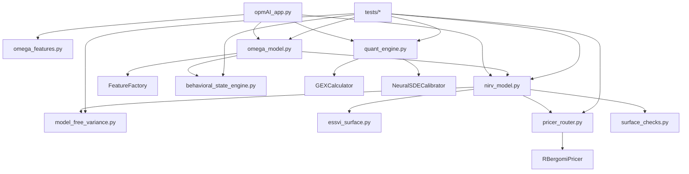

# Dependency Map (Insertion-Oriented)

This map documents where upgrades were inserted without refactoring unrelated architecture.

## Integration Points

- Surface calibration:
  - `nirv_model.py` SVI objective (optional liquidity/interval modes)
  - `essvi_surface.py` slice refinement (optional liquidity/interval modes)
- Pricing router:
  - `pricer_router.py` (`config.model == "rbergomi"` path)
- Behavioral state:
  - `behavioral_state_engine.py` additive payload passed via optional kwargs
- Dealer flow vector:
  - `quant_engine.py::GEXCalculator.compute_gex` (legacy fields preserved)
- VIX variance forward estimator:
  - `model_free_variance.py::estimate_forward_from_chain`
  - `nirv_model.py` uses improved estimator only when feature flag is enabled
