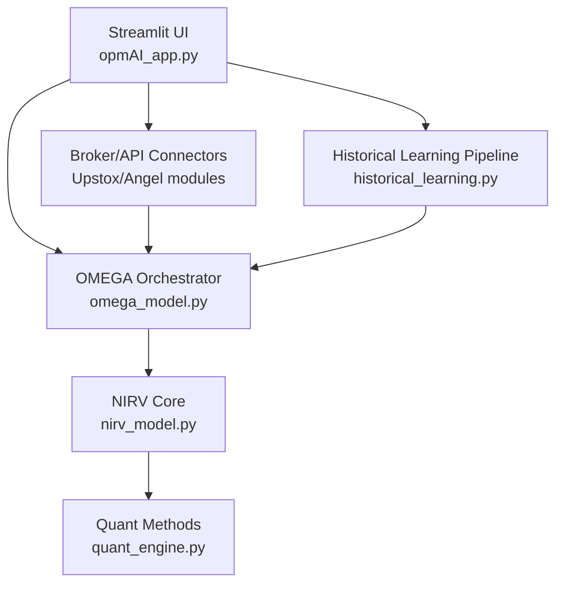
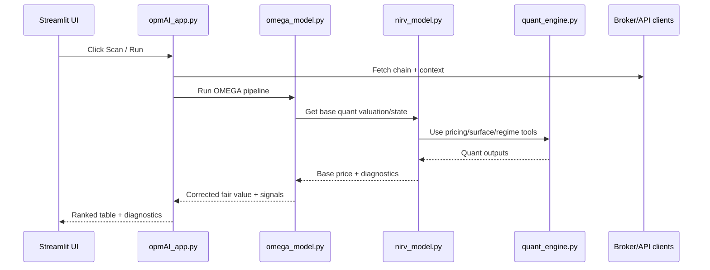
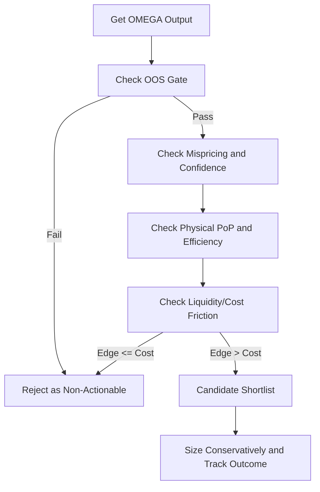
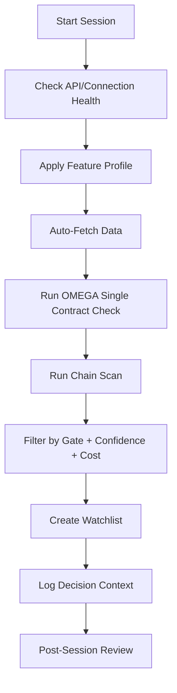
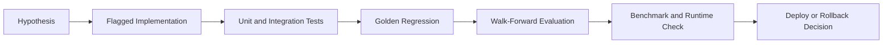

# OMEGA Textbook
## Chapters 1 to 12

## Table of Contents

- [Chapter 1: OMEGA System Overview (Super Detailed)](#chapter-1-omega-system-overview-super-detailed)
  - [Introduction](#introduction)
  - [1.1 What OMEGA Is](#11-what-omega-is)
  - [1.2 Why This System Exists](#12-why-this-system-exists)
  - [1.3 What OMEGA Is Not](#13-what-omega-is-not)
  - [1.4 Core Philosophy](#14-core-philosophy)
  - [1.5 High-Level Architecture](#15-high-level-architecture)
  - [1.6 What Each Layer Does in Plain Language](#16-what-each-layer-does-in-plain-language)
  - [1.7 Core Data Flow (Conceptual)](#17-core-data-flow-conceptual)
  - [1.8 Key Domain Concepts (Beginner-Friendly)](#18-key-domain-concepts-beginner-friendly)
  - [1.9 Reliability and Safety Philosophy](#19-reliability-and-safety-philosophy)
  - [1.10 Performance Philosophy](#110-performance-philosophy)
  - [1.11 Inputs, Outputs, and Intended Use](#111-inputs-outputs-and-intended-use)
  - [1.12 Operational Reality (Important)](#112-operational-reality-important)
  - [1.13 Chapter 1 Summary](#113-chapter-1-summary)
- [Chapter 2: Component-by-Component Deep Walkthrough](#chapter-2-component-by-component-deep-walkthrough)
  - [Introduction](#introduction-1)
  - [2.1 End-to-End Runtime Interaction](#21-end-to-end-runtime-interaction)
  - [2.2 Layer 4: Application Layer (`opmAI_app.py`)](#22-layer-4-application-layer-opmaiapppy)
  - [2.3 Layer 3: OMEGA Intelligence (`omega_model.py`)](#23-layer-3-omega-intelligence-omegamodelpy)
  - [2.4 Layer 2: NIRV Core (`nirv_model.py`)](#24-layer-2-nirv-core-nirvmodelpy)
  - [2.5 Layer 1: Quant Toolbox (`quant_engine.py`)](#25-layer-1-quant-toolbox-quantenginepy)
  - [2.6 Feature Flag Governance (`omega_features.py`)](#26-feature-flag-governance-omegafeaturespy)
  - [2.7 Upstox Client Module (`upstox_api_clients.py`)](#27-upstox-client-module-upstoxapiclientspy)
  - [2.8 Historical Learning Pipeline (`historical_learning.py`)](#28-historical-learning-pipeline-historicallearningpy)
  - [2.9 Data Contracts Between Layers](#29-data-contracts-between-layers)
  - [2.10 Common Failure Modes and Where They Are Handled](#210-common-failure-modes-and-where-they-are-handled)
  - [2.11 Extension Points (Safe Additive)](#211-extension-points-safe-additive)
  - [2.12 Conclusion](#212-conclusion)
- [Chapter 3: Execution Walkthrough (From Click to Output)](#chapter-3-execution-walkthrough-from-click-to-output)
  - [Introduction](#introduction-2)
  - [3.1 Runtime preparation before any click](#31-runtime-preparation-before-any-click)
  - [3.2 Entry point A: "AUTO-FETCH ALL DATA & RUN OMEGA"](#32-entry-point-a-auto-fetch-all-data-and-run-omega)
  - [3.3 Entry point B: "Scan Chain with OMEGA"](#33-entry-point-b-scan-chain-with-omega)
  - [3.4 OMEGA chain scanner internals](#34-omega-chain-scanner-internals)
  - [3.5 OMEGA per-option pipeline](#35-omega-per-option-pipeline)
  - [3.6 NIRV per-option base pipeline](#36-nirv-per-option-base-pipeline)
  - [3.7 How results become UI rows](#37-how-results-become-ui-rows)
  - [3.8 Manual route (fallback testing path)](#38-manual-route-fallback-testing-path)
  - [3.9 Runtime controls that affect speed and behavior](#39-runtime-controls-that-affect-speed-and-behavior)
  - [3.10 Most common "nothing happens" causes in this flow](#310-most-common-nothing-happens-causes-in-this-flow)
  - [3.11 Conclusion](#311-conclusion)
- [Chapter 4: Data Model and Feature Dictionary (Field-Level Guide)](#chapter-4-data-model-and-feature-dictionary-field-level-guide)
  - [Introduction](#introduction-3)
  - [4.1 Data-Contract-First Design](#41-data-contract-first-design)
  - [4.2 External Ingestion Schema (Upstox/Broker Side)](#42-external-ingestion-schema-upstoxbroker-side)
  - [4.3 Shared Runtime Snapshot: `MarketState`](#43-shared-runtime-snapshot-marketstate)
  - [4.4 NIRV Input Contract](#44-nirv-input-contract)
  - [4.5 NIRV Output Contract: `NirvOutput`](#45-nirv-output-contract-nirvoutput)
  - [4.6 OMEGA Feature Contract (`FeatureFactory`)](#46-omega-feature-contract-featurefactory)
  - [4.7 OMEGA Output Contract: `OMEGAOutput`](#47-omega-output-contract-omegaoutput)
  - [4.8 Historical Learning Config Contract](#48-historical-learning-config-contract)
  - [4.9 Historical Artifact Schemas](#49-historical-artifact-schemas)
  - [4.10 Engineered Feature Columns in Historical Learning](#410-engineered-feature-columns-in-historical-learning)
  - [4.11 Training Report JSON Schema](#411-training-report-json-schema)
  - [4.12 API Client Method Contracts (`upstox_api_clients.py`)](#412-api-client-method-contracts-upstoxapiclientspy)
  - [4.13 Units and Value Semantics](#413-units-and-value-semantics)
  - [4.14 Missing Data and Fallback Rules](#414-missing-data-and-fallback-rules)
  - [4.15 Time Semantics and Date Parsing](#415-time-semantics-and-date-parsing)
  - [4.16 Example: One Record Through the Pipeline](#416-example-one-record-through-the-pipeline)
  - [4.17 Data Quality Checklist (Operational)](#417-data-quality-checklist-operational)
  - [4.18 Conclusion](#418-conclusion)
- [Chapter 5: Implementation and Operations Runbook (From Zero to Working System)](#chapter-5-implementation-and-operations-runbook-from-zero-to-working-system)
  - [Introduction](#introduction-4)
  - [5.1 Recommended Environment Baseline](#51-recommended-environment-baseline)
  - [5.2 Dependency Groups and Why They Matter](#52-dependency-groups-and-why-they-matter)
  - [5.3 Clean Installation Steps (Preferred)](#53-clean-installation-steps-preferred)
  - [5.4 Secrets and Configuration Flow (`config.env`)](#54-secrets-and-configuration-flow-configenv)
  - [5.5 First Launch Runbook](#55-first-launch-runbook)
  - [5.6 Operational Modes: MacBook vs Max Accuracy](#56-operational-modes-macbook-vs-max-accuracy)
  - [5.7 Historical Learning (`Pull & Learn`) Runbook](#57-historical-learning-pull-and-learn-runbook)
  - [5.8 Validation and Regression Commands](#58-validation-and-regression-commands)
  - [5.9 Common Failure Patterns and Fixes](#59-common-failure-patterns-and-fixes)
  - [5.10 Production Hygiene Checklist (Single-User Research Mode)](#510-production-hygiene-checklist-single-user-research-mode)
  - [5.11 Repeatable Daily Workflow](#511-repeatable-daily-workflow)
  - [5.12 Chapter 5 Conclusion](#512-chapter-5-conclusion)
- [Chapter 6: Interpreting OMEGA Results and Turning Outputs into Decisions](#chapter-6-interpreting-omega-results-and-turning-outputs-into-decisions)
  - [Introduction](#introduction-5)
  - [6.1 The Interpretation Mindset](#61-the-interpretation-mindset)
  - [6.2 What to Read First on the OMEGA Result Card](#62-what-to-read-first-on-the-omega-result-card)
  - [6.3 Interpreting Fair Value vs Market Price](#63-interpreting-fair-value-vs-market-price)
  - [6.4 Layer Breakdown: What Each Extra Field Means](#64-layer-breakdown-what-each-extra-field-means)
  - [6.5 Conviction and OOS Gate: The Actionability Gatekeeper](#65-conviction-and-oos-gate-the-actionability-gatekeeper)
  - [6.6 Profit Probability Fields: Risk-Neutral vs Physical](#66-profit-probability-fields-risk-neutral-vs-physical)
  - [6.7 Cost-Aware Interpretation (Edge After Friction)](#67-cost-aware-interpretation-edge-after-friction)
  - [6.8 Chain Scan Interpretation (Table-Level)](#68-chain-scan-interpretation-table-level)
  - [6.9 Historical Learning Report Interpretation](#69-historical-learning-report-interpretation)
  - [6.10 Reliability Validation Stack (Operational Truth)](#610-reliability-validation-stack-operational-truth)
  - [6.11 Decision Flow Template](#611-decision-flow-template)
  - [6.12 Practical Scenarios](#612-practical-scenarios)
  - [6.13 Common Misinterpretation Errors](#613-common-misinterpretation-errors)
  - [6.14 How to Log Interpretation for Auditability](#614-how-to-log-interpretation-for-auditability)
  - [6.15 Chapter 6 Conclusion](#615-chapter-6-conclusion)
- [Chapter 7: Validation, Testing, and Research Quality Controls](#chapter-7-validation-testing-and-research-quality-controls)
  - [Introduction](#introduction-6)
  - [7.1 Validation Philosophy](#71-validation-philosophy)
  - [7.2 Test Inventory in This Codebase](#72-test-inventory-in-this-codebase)
  - [7.3 Golden Master Regression: Why It Matters Most](#73-golden-master-regression-why-it-matters-most)
  - [7.4 Unit and Integration Tests: What They Validate](#74-unit-and-integration-tests-what-they-validate)
  - [7.5 Leak-Safe Model Evaluation Controls](#75-leak-safe-model-evaluation-controls)
  - [7.6 Baseline vs Candidate and Rollback Logic](#76-baseline-vs-candidate-and-rollback-logic)
  - [7.7 Metrics You Should Track Every Run](#77-metrics-you-should-track-every-run)
  - [7.8 Evaluation Harness (`eval/run.py`)](#78-evaluation-harness-evalrunpy)
  - [7.9 Performance Validation (`bench/bench_pricing.py`)](#79-performance-validation-benchbenchpricingpy)
  - [7.10 Recommended Validation Sequence Before Daily Use](#710-recommended-validation-sequence-before-daily-use)
  - [7.11 Regression Incident Playbook](#711-regression-incident-playbook)
  - [7.12 Quality Gates for Accepting Model/Code Changes](#712-quality-gates-for-accepting-modelcode-changes)
  - [7.13 Chapter 7 Conclusion](#713-chapter-7-conclusion)
- [Chapter 8: Safe Extension and Customization Guide (How to Upgrade Without Breaking OMEGA)](#chapter-8-safe-extension-and-customization-guide-how-to-upgrade-without-breaking-omega)
  - [Introduction](#introduction-7)
  - [8.1 Extension Principles You Must Follow](#81-extension-principles-you-must-follow)
  - [8.2 Where to Plug In New Logic (Recommended Insertion Points)](#82-where-to-plug-in-new-logic-recommended-insertion-points)
  - [8.3 Feature Flag Workflow (Mandatory for New Behavior)](#83-feature-flag-workflow-mandatory-for-new-behavior)
  - [8.4 Adding a New Data Endpoint (Pattern)](#84-adding-a-new-data-endpoint-pattern)
  - [8.5 Adding a New Engineered Feature (Pattern)](#85-adding-a-new-engineered-feature-pattern)
  - [8.6 Adding a New Pricer or Router Tier](#86-adding-a-new-pricer-or-router-tier)
  - [8.7 Adding a New Decision Gate (e.g., reliability filter)](#87-adding-a-new-decision-gate-eg-reliability-filter)
  - [8.8 UI Extension Pattern (Minimal-Change Rule)](#88-ui-extension-pattern-minimal-change-rule)
  - [8.9 Extension Testing Matrix](#89-extension-testing-matrix)
  - [8.10 Change Checklist Before You Merge](#810-change-checklist-before-you-merge)
  - [8.11 Common Extension Mistakes to Avoid](#811-common-extension-mistakes-to-avoid)
  - [8.12 Example: Safe “New Signal Feature” Rollout](#812-example-safe-new-signal-feature-rollout)
  - [8.13 Chapter 8 Conclusion](#813-chapter-8-conclusion)
- [Chapter 9: Applied Playbooks and Real-World Usage Scenarios](#chapter-9-applied-playbooks-and-real-world-usage-scenarios)
  - [Introduction](#introduction-8)
  - [9.1 Why Playbooks Matter](#91-why-playbooks-matter)
  - [9.2 Standard Morning Scan Playbook (Fast, Repeatable)](#92-standard-morning-scan-playbook-fast-repeatable)
  - [9.3 Event-Week Playbook (RBI/Fed/Budget Risk Windows)](#93-event-week-playbook-rbifedbudget-risk-windows)
  - [9.4 Volatility Mean-Reversion Playbook](#94-volatility-mean-reversion-playbook)
  - [9.5 Directional-Edge Playbook with Reliability Gating](#95-directional-edge-playbook-with-reliability-gating)
  - [9.6 Weekly Pull & Learn Playbook](#96-weekly-pull-and-learn-playbook)
  - [9.7 End-to-End Intraday Workflow (Reference)](#97-end-to-end-intraday-workflow-reference)
  - [9.8 Failure Drill Playbook (When Results Look Wrong)](#98-failure-drill-playbook-when-results-look-wrong)
  - [9.9 Decision Journal Template (Recommended)](#99-decision-journal-template-recommended)
  - [9.10 KPI Tracking for Your Own Improvement](#910-kpi-tracking-for-your-own-improvement)
  - [9.11 Practical Guardrails](#911-practical-guardrails)
  - [9.12 Chapter 9 Conclusion](#912-chapter-9-conclusion)
- [Chapter 10: Troubleshooting, Recovery, and Operational Resilience](#chapter-10-troubleshooting-recovery-and-operational-resilience)
  - [Introduction](#introduction-9)
  - [10.1 Incident Categories](#101-incident-categories)
  - [10.2 Fast Triage Checklist (First 3 Minutes)](#102-fast-triage-checklist-first-3-minutes)
  - [10.3 Common Failure: "Scanning chain..." then no results](#103-common-failure-scanning-chain-then-no-results)
  - [10.4 Common Failure: Spot/inputs look frozen](#104-common-failure-spotinputs-look-frozen)
  - [10.5 Common Failure: Upstox expired endpoint date errors](#105-common-failure-upstox-expired-endpoint-date-errors)
  - [10.6 Common Failure: SmartAPI modules unavailable](#106-common-failure-smartapi-modules-unavailable)
  - [10.7 Pull & Learn Long-Running or Appears Stuck](#107-pull-and-learn-long-running-or-appears-stuck)
  - [10.8 Model Degradation After Retraining](#108-model-degradation-after-retraining)
  - [10.9 Latency and Performance Regression](#109-latency-and-performance-regression)
  - [10.10 Diagnostic Commands (Operational Set)](#1010-diagnostic-commands-operational-set)
  - [10.11 Recovery Playbook: Safe Return to Baseline](#1011-recovery-playbook-safe-return-to-baseline)
  - [10.12 Logging and Evidence Collection During Incidents](#1012-logging-and-evidence-collection-during-incidents)
  - [10.13 Escalation Rules](#1013-escalation-rules)
  - [10.14 Preventive Controls (Avoiding Incidents Upfront)](#1014-preventive-controls-avoiding-incidents-upfront)
  - [10.15 Chapter 10 Conclusion](#1015-chapter-10-conclusion)
- [Chapter 11: Research Roadmap and Continuous Improvement Framework](#chapter-11-research-roadmap-and-continuous-improvement-framework)
  - [Introduction](#introduction-10)
  - [11.1 Why a Roadmap Is Necessary](#111-why-a-roadmap-is-necessary)
  - [11.2 Improvement Pipeline (End-to-End)](#112-improvement-pipeline-end-to-end)
  - [11.3 Priority Research Tracks (Recommended)](#113-priority-research-tracks-recommended)
  - [11.4 What "Improvement" Should Mean](#114-what-improvement-should-mean)
  - [11.5 Experiment Design Template](#115-experiment-design-template)
  - [11.6 Promotion Criteria for New Features](#116-promotion-criteria-for-new-features)
  - [11.7 Feature Flag Lifecycle Governance](#117-feature-flag-lifecycle-governance)
  - [11.8 Data Governance for Long-Term Quality](#118-data-governance-for-long-term-quality)
  - [11.9 Evaluation Cadence (Recommended)](#119-evaluation-cadence-recommended)
  - [11.10 Risk Controls for Research Drift](#1110-risk-controls-for-research-drift)
  - [11.11 Team/Single-User Operating Model](#1111-teamsingle-user-operating-model)
  - [11.12 Advanced Roadmap Ideas (Non-Breaking)](#1112-advanced-roadmap-ideas-non-breaking)
  - [11.13 "Stop Conditions" for Experimentation](#1113-stop-conditions-for-experimentation)
  - [11.14 Chapter 11 Conclusion](#1114-chapter-11-conclusion)
- [Chapter 12: Responsible Use, Limitations, and Realistic Expectations](#chapter-12-responsible-use-limitations-and-realistic-expectations)
  - [Introduction](#introduction-11)
  - [12.1 What OMEGA Is Best At](#121-what-omega-is-best-at)
  - [12.2 What OMEGA Cannot Guarantee](#122-what-omega-cannot-guarantee)
  - [12.3 The Main Risk Sources You Must Respect](#123-the-main-risk-sources-you-must-respect)
  - [12.4 Responsible Decision Protocol](#124-responsible-decision-protocol)
  - [12.5 Realistic Performance Framing](#125-realistic-performance-framing)
  - [12.6 Position Sizing and Survival Logic](#126-position-sizing-and-survival-logic)
  - [12.7 Interpreting "No Signal" and "No Trade"](#127-interpreting-no-signal-and-no-trade)
  - [12.8 How to Communicate Results Honestly](#128-how-to-communicate-results-honestly)
  - [12.9 Ethical and Practical Boundaries](#129-ethical-and-practical-boundaries)
  - [12.10 Long-Run User Discipline Framework](#1210-long-run-user-discipline-framework)
  - [12.11 Common Behavioral Pitfalls (and Corrections)](#1211-common-behavioral-pitfalls-and-corrections)
  - [12.12 Final Operating Checklist](#1212-final-operating-checklist)
  - [12.13 Closing Summary of the Full Textbook](#1213-closing-summary-of-the-full-textbook)
  - [12.14 Chapter 12 Conclusion](#1214-chapter-12-conclusion)

---

## Chapter 1: OMEGA System Overview (Super Detailed)

### Introduction
This chapter explains what OMEGA is, why it exists, what problems it tries to solve, what it does not solve, and how the major parts of the codebase fit together.

Codebase analyzed: `/Users/caaniketh/Optionpricingmodel Ai/OPM-with-TVR-NIRV-OMEGA-Models-`

### 1.1 What OMEGA Is

OMEGA is a multi-layer options analytics and pricing system for Indian index options (primarily NIFTY).

It combines:

1. Quant pricing models (BSM/SABR/Heston/jump models).
2. Volatility surface modeling (SVI/eSSVI paths depending on flags).
3. Market regime logic (state detection like calm/stressed behavior).
4. ML residual correction (learn model error patterns).
5. Execution-aware filtering (spread/slippage/risk checks).
6. Streamlit UI for interactive analysis and scanning.

In simple terms: OMEGA first builds a mathematically fair price, then adjusts it with learned error patterns, then filters opportunities using practical market constraints.

### 1.2 Why This System Exists

A raw pricing model alone is usually not enough in live options markets because:

1. Real option markets have microstructure noise (wide spreads, stale quotes, missing strikes).
2. Volatility is not constant across strikes and expiries.
3. Regimes change (quiet market vs panic market).
4. "Cheap-looking" contracts can still be bad due to liquidity and execution costs.
5. Single-model assumptions break under event risk and jump risk.

OMEGA addresses this by using layered corrections instead of trusting one model output blindly.

### 1.3 What OMEGA Is Not

OMEGA is not:

1. A guaranteed-profit machine.
2. A replacement for risk management.
3. A fully autonomous execution engine by default.
4. Immune to regime shifts or data quality failures.

This is a research and decision-support system. It can improve process quality, but it cannot eliminate market uncertainty.

### 1.4 Core Philosophy

The design philosophy is visible across the stack:

1. `Physics first, ML second`: build base value from quant methods, then correct residuals with ML.
2. `Additive evolution`: new features behind flags, defaults preserve baseline behavior.
3. `Regression safety`: golden tests protect old behavior when new flags are off.
4. `CPU practicality`: supports fast routing and MacBook-friendly operation.
5. `Separation of concerns`: UI, orchestration, pricing core, and quant toolbox are clearly split.

### 1.5 High-Level Architecture

Primary files:

1. App layer: `/Users/caaniketh/Optionpricingmodel Ai/OPM-with-TVR-NIRV-OMEGA-Models-/opmAI_app.py`
2. OMEGA orchestration: `/Users/caaniketh/Optionpricingmodel Ai/OPM-with-TVR-NIRV-OMEGA-Models-/omega_model.py`
3. NIRV pricing core: `/Users/caaniketh/Optionpricingmodel Ai/OPM-with-TVR-NIRV-OMEGA-Models-/nirv_model.py`
4. Quant toolbox: `/Users/caaniketh/Optionpricingmodel Ai/OPM-with-TVR-NIRV-OMEGA-Models-/quant_engine.py`
5. Feature flags: `/Users/caaniketh/Optionpricingmodel Ai/OPM-with-TVR-NIRV-OMEGA-Models-/omega_features.py`



### 1.6 What Each Layer Does in Plain Language

1. Layer 4 (`opmAI_app.py`)
Handles user interaction, live input syncing, data fetch, scan triggers, and presentation of outputs.
2. Layer 3 (`omega_model.py`)
Acts as the decision brain. It assembles features, applies ML correction, anomaly filters, sentiment/behavior inputs, and produces structured OMEGA outputs.
3. Layer 2 (`nirv_model.py`)
Produces advanced model-based pricing context: regime, surface, stochastic-vol/jump pricing, confidence components, and mispricing signals.
4. Layer 1 (`quant_engine.py`)
Contains reusable quantitative methods (SABR, HestonCOS, GARCH-like components, optimization, Kelly/risk metrics, and other research tools).

### 1.7 Core Data Flow (Conceptual)

At a high level, one scan cycle is:

1. Pull market data (chain/quotes/context).
2. Normalize inputs (spot, strike, expiry, rates, vol inputs, market state).
3. Build baseline prices from quant core.
4. Build feature vector from model + market context.
5. Apply ML correction on residual gap.
6. Score/rank/filter opportunities by confidence, liquidity, edge.
7. Present results and diagnostics in UI.

Minimal conceptual code:

```python
# Conceptual, simplified
market_state = collect_market_state()
nirv_out = nirv_model.price_and_diagnose(option_input, market_state)
omega_out = omega_model.run_with_correction(option_input, market_state, nirv_out)
ranked = rank_and_filter([omega_out, ...])
```

### 1.8 Key Domain Concepts (Beginner-Friendly)

1. Fair value
The model's estimate of what an option should cost under current assumptions.
2. Mispricing
Difference between market price and model-derived fair value.
3. Residual correction
ML learns the repeatable error pattern between model and market.
4. Regime
A detected market state (for example calm, trending, stressed). Different states can require different parameter behavior.
5. Surface
A 2D map of implied volatility over strike and expiry, used for realistic option pricing.
6. VRP/variance context
Difference between risk-neutral implied variance and expected realized variance. Useful for risk-premium state inference.

### 1.9 Reliability and Safety Philosophy

OMEGA is designed with "safe extension" principles:

1. New features are flag-controlled in `/Users/caaniketh/Optionpricingmodel Ai/OPM-with-TVR-NIRV-OMEGA-Models-/omega_features.py`.
2. Default path should remain legacy-consistent unless correctness requires change.
3. Golden and unit tests are used to detect unintended drift.
4. Streamlit app includes safeguards and staged actions (manual or button-triggered heavy flows).
5. Rollback logic exists in historical learning paths to avoid replacing a better artifact with a worse candidate.

### 1.10 Performance Philosophy

The project tries to balance depth and responsiveness:

1. Fast scan paths for broad chain coverage.
2. Heavier pricers/calibration used selectively.
3. Caching for expensive computations in app flows.
4. Runtime profiles including MacBook-friendly settings.
5. Avoid recalculating heavy components on every widget change.

### 1.11 Inputs, Outputs, and Intended Use

Typical inputs:

1. Option chain data.
2. Spot and expiry metadata.
3. Market context (vol proxies, flows, technical features, rates).
4. Optional news/sentiment/context fields.

Typical outputs:

1. OMEGA fair value.
2. Mispricing percentage and signal side.
3. Confidence and quality diagnostics.
4. Risk-oriented details (cost sensitivity, regime context, sometimes plan-like outputs).

Intended use:

1. Triage and rank opportunities.
2. Compare market price vs model-adjusted value.
3. Run research/backtest/historical learning loops.
4. Support decision-making with explicit uncertainty and constraints.

### 1.12 Operational Reality (Important)

Even a strong architecture can fail in practice when:

1. API data is stale/incomplete.
2. Liquidity is poor (midpoint is not executable reality).
3. Regime shifts invalidate learned residual patterns.
4. Latency or slippage erodes modeled edge.
5. Overfitting occurs in retraining.

That is why OMEGA includes validation, walk-forward style evaluation, and rollback behavior instead of "always replace" training.

### 1.13 Chapter 1 Summary

Key takeaways:

1. OMEGA is a layered quant + ML options analysis framework, not a single formula.
2. It is built for Indian options microstructure realities, not textbook ideal markets.
3. Its architecture separates UI, orchestration, pricing core, and quant methods for maintainability.
4. It emphasizes regression safety, feature flags, and CPU-aware operation.
5. It provides probabilistic decision support, not certainty.

---

## Chapter 2: Component-by-Component Deep Walkthrough

### Introduction
This chapter explains each major component in your codebase, what responsibility it owns, what data it expects, what it returns, and how components interact during a real run.

Codebase scope used:

1. `/Users/caaniketh/Optionpricingmodel Ai/OPM-with-TVR-NIRV-OMEGA-Models-/opmAI_app.py`
2. `/Users/caaniketh/Optionpricingmodel Ai/OPM-with-TVR-NIRV-OMEGA-Models-/omega_model.py`
3. `/Users/caaniketh/Optionpricingmodel Ai/OPM-with-TVR-NIRV-OMEGA-Models-/nirv_model.py`
4. `/Users/caaniketh/Optionpricingmodel Ai/OPM-with-TVR-NIRV-OMEGA-Models-/quant_engine.py`
5. `/Users/caaniketh/Optionpricingmodel Ai/OPM-with-TVR-NIRV-OMEGA-Models-/omega_features.py`
6. `/Users/caaniketh/Optionpricingmodel Ai/OPM-with-TVR-NIRV-OMEGA-Models-/upstox_api_clients.py`
7. `/Users/caaniketh/Optionpricingmodel Ai/OPM-with-TVR-NIRV-OMEGA-Models-/historical_learning.py`

### 2.1 End-to-End Runtime Interaction



### 2.2 Layer 4: Application Layer (`opmAI_app.py`)

#### 2.2.1 Core app role
`/Users/caaniketh/Optionpricingmodel Ai/OPM-with-TVR-NIRV-OMEGA-Models-/opmAI_app.py` is the orchestration shell for:

1. User input capture.
2. Live/historical data fetching.
3. State synchronization across models.
4. Triggering pricing and scan pipelines.
5. Rendering metrics/tables/charts.

#### 2.2.2 `MarketState` object
`MarketState` is the shared state container used by NIRV and OMEGA paths.
It carries spot, VIX-like fields, rates, flow proxies, IV/HV context, regime tags, and cached lagged mispricing features.

Why this matters:

1. Prevents each model from using different market snapshots.
2. Reduces accidental state drift across tabs.
3. Makes debugging easier because inputs are centralized.

#### 2.2.3 Reconciliation and execution realism
`PricingReconciler` and `WalkForwardBacktester` provide:

1. Model divergence checks (NIRV vs TVR vs BSM).
2. Cost-aware filtering via slippage and cost estimates.
3. Break-even edge logic to avoid false "cheap" signals.

#### 2.2.4 Data connectors and session infrastructure
This file contains connector classes and managers for:

1. Upstox live flows (`UpstoxDataFetcher`, `UpstoxV3Engine`).
2. Angel One flows (`AngelOne...` classes).
3. Shared session wrappers and fallback paths.

Design intent:

1. Keep broker variability in app layer adapters.
2. Keep quant layers broker-agnostic.

#### 2.2.5 Caching and runtime controls
There are cached helper functions for chain/TA/VIX/master data/report view parsing.
This reduces rerun overhead in Streamlit and keeps scan responsiveness acceptable.

#### 2.2.6 OMEGA tab runtime path
In the OMEGA tab:

1. Models initialize via cached constructors.
2. "Auto-fetch" pulls market context and pushes values into UI/session state.
3. Scan button runs full-chain OMEGA evaluation.
4. Manual run path allows user override inputs.
5. Feature flag sidebar can apply predefined profiles.

#### 2.2.7 Historical Learning UI hook
The "Historical Learning" section wires:

1. User-selected underlying/date/interval/window.
2. "Pull & Learn" trigger.
3. Progress/status messages.
4. Reporting of rows, metrics, artifact paths.

### 2.3 Layer 3: OMEGA Intelligence (`omega_model.py`)

#### 2.3.1 Top-level mission
`/Users/caaniketh/Optionpricingmodel Ai/OPM-with-TVR-NIRV-OMEGA-Models-/omega_model.py` is the decision layer that converts base quant outputs into actionable corrected outputs.

#### 2.3.2 Key classes and roles

1. `FactorRegistry`
Central dictionary of features/factors, including metadata and source hints.
Useful for transparency and future feature governance.
2. `OMEGAOutput`
Structured output object so downstream display/filters can use stable fields.
3. `FeatureFactory`
Builds feature vectors from market state + option context + model diagnostics.
4. `MLPricingCorrector`
Learns residual bias and predicts correction factor/value.
5. `EfficiencyHunter`
Scores inefficiency opportunities after correction and sanity checks.
6. `SentimentIntelligence`
Adds optional sentiment-based context adjustments when available.
7. `BehavioralEngine`
Encodes behavioral regime interpretations and possible market reaction biases.
8. `PredictionTracker`
Logs prediction context and outcomes for learning loop quality.
9. `TradePlanGenerator`
Converts model output to structured trade/risk plan elements.
10. `OMEGAModel`
Master orchestrator: NIRV base -> ML correction -> filters -> final signal.

#### 2.3.3 OMEGA combine logic
Conceptually:

1. Start with NIRV base value.
2. Estimate correction from ML residual model.
3. Apply optional sentiment/behavior adjustments.
4. Compute edge/signal/confidence package.
5. Return `OMEGAOutput`.

This layered combine is safer than replacing quant price entirely with ML prediction.

#### 2.3.4 Chain scan behavior
`OMEGAModel` includes chain-scan logic that iterates strikes and CE/PE contracts, runs per-contract analysis, handles warnings per leg, then ranks output by relevance criteria.

### 2.4 Layer 2: NIRV Core (`nirv_model.py`)

#### 2.4.1 Core mission
`/Users/caaniketh/Optionpricingmodel Ai/OPM-with-TVR-NIRV-OMEGA-Models-/nirv_model.py` builds robust base pricing and diagnostics from regime + surface + stochastic models.

#### 2.4.2 Key classes and roles

1. `IndiaFeatureEngine`
Converts macro/market context into India-specific risk features.
2. `RegimeDetector`
Detects market state and supports parameter adaptation.
3. `VolatilitySurface`
Fits smile/surface structure for consistent IV handling.
4. `HestonJumpDiffusionPricer`
Handles stochastic volatility and jump risk in base valuation.
5. `BayesianConfidenceEngine`
Converts distributional evidence to confidence/probability-like signals.
6. `GreeksCalculator`
Produces risk sensitivities used in diagnostics and filtering.
7. `MispricingSignal`
Constructs signal orientation/strength from market-vs-fair comparisons.
8. `NIRVModel`
Full pipeline coordinator for per-option and chain-like workflows.

#### 2.4.3 NIRV output importance
NIRV does not only output price; it outputs context that OMEGA uses:

1. Pricing diagnostics.
2. Confidence signals.
3. Regime-informed values.
4. Greeks/risk stats.

This is why OMEGA can stay interpretable rather than being a black box.

### 2.5 Layer 1: Quant Toolbox (`quant_engine.py`)

#### 2.5.1 Mission
`/Users/caaniketh/Optionpricingmodel Ai/OPM-with-TVR-NIRV-OMEGA-Models-/quant_engine.py` is the mathematical utilities and research methods library.

#### 2.5.2 Important components

1. `DynamicSABR`
Smile/skew-friendly parametric model tools.
2. `GJRGarch`
Realized volatility forecasting with asymmetric shock response.
3. `HestonCOS`
Fast semi-analytical valuation path for speed-sensitive use cases.
4. `EMJumpEstimator`
Jump process parameter estimation.
5. `MLSignalPipeline`
Separate ML pipeline utilities for signal support.
6. `KellyCriterion`
Risk sizing calculations and conservative sizing variants.
7. `BayesianPosteriorConfidence`
Posterior-style confidence estimation helpers.
8. `GEXCalculator`
Dealer positioning proxies and related signal context.
9. `QuantEngine`
Integrator class combining quant methods for broader workflows.

#### 2.5.3 Why this layer separation works

1. Reusability across NIRV and app tools.
2. Easier benchmarking/replacement of specific methods.
3. Cleaner performance tuning boundaries.

### 2.6 Feature Flag Governance (`omega_features.py`)

`/Users/caaniketh/Optionpricingmodel Ai/OPM-with-TVR-NIRV-OMEGA-Models-/omega_features.py` controls experimental/upgrade behavior.
It includes:

1. Boolean flags for v6 additions.
2. JSON/env override loading.
3. Preset profiles like MacBook-friendly and max-accuracy modes.
4. Centralized methods to set/get active feature config.

Why this is critical:

1. Backward compatibility.
2. Controlled rollout.
3. Clear A/B comparison path.

### 2.7 Upstox Client Module (`upstox_api_clients.py`)

`/Users/caaniketh/Optionpricingmodel Ai/OPM-with-TVR-NIRV-OMEGA-Models-/upstox_api_clients.py` provides:

1. Base GET client with timeout/retry/backoff.
2. Endpoint-specific wrappers for options contracts, expiries, quotes, OHLC, greeks, LTP, and expired historical data.
3. Input validation and response status checks.
4. Candle parsing to DataFrame.
5. Date format fallback handling for known expired-contract endpoint strictness.

This module isolates API contract logic from model logic.

### 2.8 Historical Learning Pipeline (`historical_learning.py`)

`/Users/caaniketh/Optionpricingmodel Ai/OPM-with-TVR-NIRV-OMEGA-Models-/historical_learning.py` provides:

1. Pull flow: expiries -> expired contracts -> candles.
2. Feature engineering: returns, realized vol proxies, range metrics, time features.
3. Label creation aligned with residual correction objectives.
4. Time-safe train/test logic (no random shuffle).
5. Artifact persistence and training report generation.
6. Rollback logic if candidate performance degrades past tolerance.
7. Runtime budgets to prevent endless Streamlit spinner behavior.

### 2.9 Data Contracts Between Layers

Main contracts are simple dictionaries/dataframes/typed outputs:

1. App -> OMEGA input snapshot (spot, strike, dte, chain fields, market context).
2. OMEGA -> NIRV call parameters.
3. NIRV -> OMEGA diagnostics (base fair value + state metrics).
4. OMEGA -> App via `OMEGAOutput`.
5. Historical learning -> artifacts/report paths + metrics summary.

Strong contract discipline is what keeps additive upgrades from breaking old paths.

### 2.10 Common Failure Modes and Where They Are Handled

1. API date format mismatch
Handled in `upstox_api_clients.py` with format fallback attempt.
2. Missing optional dependencies
App has guarded imports and fallback behavior patterns.
3. Infinite-feel long runs in Pull & Learn
Handled via runtime budgets and smaller fast-mode defaults.
4. Stale or weak data quality
Filtering and quality checks occur before final ranking where possible.
5. Candidate model worse than baseline
Rollback logic in historical learning path preserves prior artifact.

### 2.11 Extension Points (Safe Additive)

Best places to extend without architecture break:

1. Add new endpoint wrappers in `upstox_api_clients.py`.
2. Add engineered features in `historical_learning.py`.
3. Add feature flags in `omega_features.py`.
4. Add optional diagnostics panels in `opmAI_app.py`.
5. Add optional ranking modifiers in OMEGA layer behind flags.

Avoid extending by refactoring core orchestration signatures unless necessary.

### 2.12 Conclusion
Chapter 2 shows that OMEGA is intentionally layered and contract-driven:

1. `opmAI_app.py` handles IO, state sync, and UI control.
2. `omega_model.py` handles correction, intelligence, and decision packaging.
3. `nirv_model.py` handles robust base pricing and regime-aware diagnostics.
4. `quant_engine.py` supplies reusable quantitative machinery.
5. Add-on modules (`upstox_api_clients.py`, `historical_learning.py`) extend capability without architectural rewrite.

---

## Chapter 3: Execution Walkthrough (From Click to Output)

### Introduction
This chapter traces the actual runtime path when you run OMEGA in the app.
Focus: what runs first, what each layer computes, where results are ranked, and where failures can occur.

### 3.1 Runtime preparation before any click

Before OMEGA tab actions, the app prepares three key things:

1. Feature flags from sidebar are applied in `/Users/caaniketh/Optionpricingmodel Ai/OPM-with-TVR-NIRV-OMEGA-Models-/opmAI_app.py:656`.
2. Cached model factories are available:
   - NIRV cache: `/Users/caaniketh/Optionpricingmodel Ai/OPM-with-TVR-NIRV-OMEGA-Models-/opmAI_app.py:835`
   - OMEGA cache: `/Users/caaniketh/Optionpricingmodel Ai/OPM-with-TVR-NIRV-OMEGA-Models-/opmAI_app.py:841`
3. Shared market/session context is stored in session state and `MarketState` (`/Users/caaniketh/Optionpricingmodel Ai/OPM-with-TVR-NIRV-OMEGA-Models-/opmAI_app.py:90`).

Why this matters: expensive model initialization is not repeated on every widget change.

### 3.2 Entry point A: "AUTO-FETCH ALL DATA & RUN OMEGA"

Button anchor:
`/Users/caaniketh/Optionpricingmodel Ai/OPM-with-TVR-NIRV-OMEGA-Models-/opmAI_app.py:20396`

Execution path:

1. Reset synthetic fallback markers.
2. Run 4 phased fetch pipeline:
   - Upstox market data.
   - Global market context.
   - AI intelligence context.
   - Seasonal/calendar factors.
3. Save fetched data into session (`omega_auto_data`, `omega_auto_report`).
4. Auto-sync UI/model inputs from fetched data.
5. Resolve spot/strike/type and nearest live market price from option chain.
6. Attach cached NIRV instance to OMEGA.
7. Build sentiment and behavioral context bundles.
8. Compute DTE and call `omega.price_option(...)`.

This is the "single-option full intelligence" route, not a broad chain scan.

### 3.3 Entry point B: "Scan Chain with OMEGA"

Button anchor:
`/Users/caaniketh/Optionpricingmodel Ai/OPM-with-TVR-NIRV-OMEGA-Models-/opmAI_app.py:20730`
Spinner anchor:
`/Users/caaniketh/Optionpricingmodel Ai/OPM-with-TVR-NIRV-OMEGA-Models-/opmAI_app.py:20735`

Execution path in app:

1. Initialize scan state (`omega_scan_ran`, `omega_scan_results`, reason field).
2. Pull live chain data from `omega_auto_data`.
3. Build strike window around ATM (default ATM +/-10 strikes, 50-step).
4. Build CE and PE price maps from chain LTP.
5. If no prices exist, set reason `no_live_chain` and return early.
6. Otherwise attach cached NIRV (lighter path count for scan speed).
7. Call `omega.scan_chain(...)` with:
   - market dictionaries,
   - contextual factors,
   - CPU budget (`cpu_budget_ms`, default tight budget in scan mode).
8. Save results and reason code (`ok`, `empty_after_filters`, etc.).
9. Render ranked dataframe and top pick.

### 3.4 OMEGA chain scanner internals

Method anchor:
`/Users/caaniketh/Optionpricingmodel Ai/OPM-with-TVR-NIRV-OMEGA-Models-/omega_model.py:2330`

`OMEGAModel.scan_chain(...)` does:

1. Loop each strike.
2. If CE quote exists, run `self.price_option(...)`.
3. If PE quote exists, run `self.price_option(...)`.
4. Catch per-contract exceptions and continue scan.
5. Apply ranking policy depending on flags:
   - Research high conviction mode: keep only 9/10+ conviction.
   - Enhanced ranking mode: edge-like composite score.
   - Default mode: sort by efficiency score then physical PoP.

So scan quality is mostly driven by repeated calls to `OMEGAModel.price_option(...)`.

### 3.5 OMEGA per-option pipeline

Method anchor:
`/Users/caaniketh/Optionpricingmodel Ai/OPM-with-TVR-NIRV-OMEGA-Models-/omega_model.py:1959`

Class anchors:

- Feature extraction: `/Users/caaniketh/Optionpricingmodel Ai/OPM-with-TVR-NIRV-OMEGA-Models-/omega_model.py:321`
- ML corrector: `/Users/caaniketh/Optionpricingmodel Ai/OPM-with-TVR-NIRV-OMEGA-Models-/omega_model.py:563`
- Efficiency scoring: `/Users/caaniketh/Optionpricingmodel Ai/OPM-with-TVR-NIRV-OMEGA-Models-/omega_model.py:762`
- Sentiment: `/Users/caaniketh/Optionpricingmodel Ai/OPM-with-TVR-NIRV-OMEGA-Models-/omega_model.py:922`
- Behavioral: `/Users/caaniketh/Optionpricingmodel Ai/OPM-with-TVR-NIRV-OMEGA-Models-/omega_model.py:1081`
- Prediction tracking: `/Users/caaniketh/Optionpricingmodel Ai/OPM-with-TVR-NIRV-OMEGA-Models-/omega_model.py:1314`

Step-by-step:

1. Call NIRV base model first (`self.nirv.price_option(...)`).
2. Build enriched feature dictionary from market + NIRV output.
3. Extract standardized features via `FeatureFactory.extract`.
4. ML correction layer:
   - Standard point correction, or
   - Conformal interval correction when enabled.
5. Efficiency scoring layer runs and updates historical state.
6. Sentiment analysis layer (if sentiment payload is present).
7. Behavioral impact layer (if behavior context is present).
8. Combine all into OMEGA fair value:
   - `NIRV fair value` + `ML correction` + `sentiment adjustment`.
9. Generate signal using `_enhanced_signal` (`/Users/caaniketh/Optionpricingmodel Ai/OPM-with-TVR-NIRV-OMEGA-Models-/omega_model.py:2184`).
10. Optional actionability gates:
    - conformal interval gate,
    - high-conviction research gate,
    - OOS reliability gate (`/Users/caaniketh/Optionpricingmodel Ai/OPM-with-TVR-NIRV-OMEGA-Models-/omega_model.py:2273`).
11. Record prediction in tracker for future learning.
12. Return `OMEGAOutput` with full diagnostics package.

### 3.6 NIRV per-option base pipeline

Method anchor:
`/Users/caaniketh/Optionpricingmodel Ai/OPM-with-TVR-NIRV-OMEGA-Models-/nirv_model.py:2291`

Class anchors:

- `NIRVModel`: `/Users/caaniketh/Optionpricingmodel Ai/OPM-with-TVR-NIRV-OMEGA-Models-/nirv_model.py:2231`
- `RegimeDetector`: `/Users/caaniketh/Optionpricingmodel Ai/OPM-with-TVR-NIRV-OMEGA-Models-/nirv_model.py:261`
- `VolatilitySurface`: `/Users/caaniketh/Optionpricingmodel Ai/OPM-with-TVR-NIRV-OMEGA-Models-/nirv_model.py:549`
- `HestonJumpDiffusionPricer`: `/Users/caaniketh/Optionpricingmodel Ai/OPM-with-TVR-NIRV-OMEGA-Models-/nirv_model.py:1100`
- `BayesianConfidenceEngine`: `/Users/caaniketh/Optionpricingmodel Ai/OPM-with-TVR-NIRV-OMEGA-Models-/nirv_model.py:1570`
- `MispricingSignal`: `/Users/caaniketh/Optionpricingmodel Ai/OPM-with-TVR-NIRV-OMEGA-Models-/nirv_model.py:1917`

Runtime stages:

1. Input sanitization and normalization (spot/strike/T/price floors).
2. Optional model-free variance and VRP state ingestion (flag-gated).
3. India-specific feature engineering.
4. Regime detection + regime parameter selection.
5. Optional VRP-based conservative parameter multipliers.
6. Implied vol from volatility surface.
7. Optional quant extras (GARCH, jump estimation, Heston COS cross-check).
8. Pricing path:
   - Tiered pricer router if enabled, else
   - baseline Monte Carlo pricer.
9. Confidence and probability estimation from terminal distribution.
10. Bayesian confidence blending.
11. Signal generation from fair-vs-market and confidence.
12. Greeks estimation and diagnostics attachment.
13. Update `self.state` fields (model-free var, VRP, surface diagnostics, route info).
14. Return `NirvOutput`.

### 3.7 How results become UI rows

Once `scan_results` are returned to app:

1. App converts each tuple `(Type, Strike, OMEGAOutput)` into display row.
2. Key fields shown include:
   - OMEGA fair value,
   - market,
   - mispricing,
   - physical PoP,
   - efficiency,
   - confidence,
   - conviction,
   - OOS gate status.
3. App applies signal color style and identifies top BUY candidate.

Main rendering block is in the OMEGA tab section near:
`/Users/caaniketh/Optionpricingmodel Ai/OPM-with-TVR-NIRV-OMEGA-Models-/opmAI_app.py:20642` onward and scan table section starting near `:20730`.

### 3.8 Manual route (fallback testing path)

Button anchor:
`/Users/caaniketh/Optionpricingmodel Ai/OPM-with-TVR-NIRV-OMEGA-Models-/opmAI_app.py:20871`

This path is simpler:

1. Uses user-entered spot/strike/price/VIX/DTE.
2. Attaches cached NIRV.
3. Uses synthetic returns fallback if needed.
4. Calls `omega.price_option(...)`.
5. Displays immediate signal/fair value summary.

Useful for sanity checks independent of full chain fetch.

### 3.9 Runtime controls that affect speed and behavior

Important controls:

1. Feature flags from `omega_features.py` (`/Users/caaniketh/Optionpricingmodel Ai/OPM-with-TVR-NIRV-OMEGA-Models-/omega_features.py`).
2. Cached model constructors in app (`:835`, `:841`).
3. Path counts and bootstrap sizes differ by route (scan vs deep run).
4. `cpu_budget_ms` passed down in scan/manual/auto paths.
5. Safety control checks can intentionally block actions.

### 3.10 Most common "nothing happens" causes in this flow

When spinner appears but no useful rows:

1. No live chain data in session (`no_live_chain`).
2. Safety gate blocks execution.
3. Strict research filters remove all candidates.
4. All candidates filtered by actionability/OOS gates.
5. Upstream API returned partial/invalid chain.
6. Tight CPU budget + strict filters can produce empty list quickly.

You can diagnose by checking `omega_scan_reason` and whether `omega_auto_data.option_chain` is populated.

### 3.11 Conclusion

Chapter 3 takeaway:

1. OMEGA execution is a two-stage valuation:
   - NIRV builds base fair value.
   - OMEGA applies correction/intelligence layers.
2. Chain scan is just repeated per-option execution + ranking policy.
3. Most observed runtime issues come from data readiness, gating, or strict filtering, not from the UI itself.
4. The architecture is intentionally traceable: app trigger -> OMEGA -> NIRV -> quant tools -> OMEGA output -> ranked UI.

---

## Chapter 4: Data Model and Feature Dictionary (Field-Level Guide)

### Introduction
This chapter defines the data contracts used by OMEGA from ingestion to model output.
It is a practical field guide for developers, researchers, and reviewers.

Primary goals:

1. Explain exactly what each core object contains.
2. Define units and expected value ranges.
3. Show how data transforms across layers.
4. Clarify optional fields and fallback behavior.
5. Make debugging and extension safer.

---

### 4.1 Data-Contract-First Design

OMEGA is easier to maintain because it relies on stable contracts between layers:

1. UI/data adapters produce normalized option and market context.
2. NIRV expects a fixed pricing input signature and returns `NirvOutput`.
3. OMEGA consumes NIRV output plus contextual features and returns `OMEGAOutput`.
4. Historical learning persists raw and processed artifacts in predictable paths.

Core contract files:

1. `/Users/caaniketh/Optionpricingmodel Ai/OPM-with-TVR-NIRV-OMEGA-Models-/opmAI_app.py`
2. `/Users/caaniketh/Optionpricingmodel Ai/OPM-with-TVR-NIRV-OMEGA-Models-/nirv_model.py`
3. `/Users/caaniketh/Optionpricingmodel Ai/OPM-with-TVR-NIRV-OMEGA-Models-/omega_model.py`
4. `/Users/caaniketh/Optionpricingmodel Ai/OPM-with-TVR-NIRV-OMEGA-Models-/historical_learning.py`
5. `/Users/caaniketh/Optionpricingmodel Ai/OPM-with-TVR-NIRV-OMEGA-Models-/upstox_api_clients.py`

---

### 4.2 External Ingestion Schema (Upstox/Broker Side)

At ingestion level, option-chain rows are broker shaped, then normalized.

Typical chain row fields used in app logic:

1. `strike_price`
2. `call_options.market_data.ltp`
3. `put_options.market_data.ltp`
4. Optional bid/ask/OI/volume fields when available
5. Expiry and instrument keys

Normalized contract metadata from historical API pipeline includes:

1. `_contract_key` (unique expired option key)
2. `_strike`
3. `_option_type` (`CE` or `PE`)
4. `expiry_date`
5. `trading_symbol`

Data sanity expectations:

1. LTP and strike must be positive finite numbers.
2. Contract key must be non-empty for historical candle pull.
3. Expiry date must parse reliably (`YYYY-MM-DD` preferred, fallback formats supported).

---

### 4.3 Shared Runtime Snapshot: `MarketState`

Defined in:
`/Users/caaniketh/Optionpricingmodel Ai/OPM-with-TVR-NIRV-OMEGA-Models-/opmAI_app.py:90`

Purpose:

1. Single source of truth for live snapshot data.
2. Prevent model branches from reading inconsistent values.

Key fields:

| Field | Type | Meaning | Typical Unit |
|---|---|---|---|
| `spot` | `float` | Underlying spot | INR |
| `india_vix` | `float` | Volatility proxy | Index points |
| `vix_term_slope` | `float` | Near-far vol slope | points |
| `fii_net_flow`, `dii_net_flow` | `float` | Net flows | INR crores |
| `pcr_oi` | `float` | Put-call OI ratio | ratio |
| `returns_30d` | `np.ndarray/None` | Return history | decimal |
| `hv_30d` | `float` | Historical vol proxy | annualized decimal |
| `iv_rank`, `iv_percentile` | `float` | Relative IV stats | 0-100 |
| `rsi`, `macd_signal`, `bb_position`, `atr_pct` | `float` | Technicals | mixed |
| `days_to_rbi`, `days_to_fed` | `int` | Event proximity | days |
| `r`, `q` | `float` | Rate/dividend assumptions | decimal |
| `inr_usd_vol` | `float` | FX risk proxy | annualized decimal |
| `regime` | `str` | Last known regime | label |
| `gex_total`, `gex_sign` | `float/int` | Dealer gamma context | mixed |
| `atm_iv` | `float` | ATM vol proxy | decimal |
| `last_updated` | `datetime/None` | Snapshot timestamp | time |
| `cboe_vix`, `crude_price`, `usd_inr`, `sgx_nifty` | optional numeric | Cross-asset context | mixed |

Internal helper state:

1. `_mispricing_history` is used to build lag features for repeated contracts.
2. Exposed via `get_lagged_mispricing(...)`.

---

### 4.4 NIRV Input Contract

Method signature:
`/Users/caaniketh/Optionpricingmodel Ai/OPM-with-TVR-NIRV-OMEGA-Models-/nirv_model.py:2291`

Required arguments:

1. `spot`, `strike`, `T`, `r`, `q`
2. `option_type`, `market_price`
3. `india_vix`, `fii_net_flow`, `dii_net_flow`
4. `days_to_rbi`, `pcr_oi`, `returns_30d`

Optional enrichment (kwargs):

1. `model_free_var_30d`
2. `model_free_var_term_structure`
3. `vrp_state`
4. `cpu_budget_ms`
5. full-chain hints and routing hints in scan mode

Input normalization rules:

1. Floors and finite checks are applied (`spot`, `strike`, `T`, `market_price`).
2. Missing volatility defaults to conservative proxy.
3. `days_to_expiry` computed from `T`.

---

### 4.5 NIRV Output Contract: `NirvOutput`

Defined in:
`/Users/caaniketh/Optionpricingmodel Ai/OPM-with-TVR-NIRV-OMEGA-Models-/nirv_model.py:119`

Schema:

| Field | Meaning |
|---|---|
| `fair_value` | Base model fair value |
| `market_price` | Observed market price |
| `mispricing_pct` | `(fair-market)/market * 100` |
| `signal` | `BUY/SELL/HOLD` |
| `profit_probability` | Risk-neutral PoP |
| `physical_profit_prob` | Physical-measure PoP |
| `confidence_level` | Confidence score (%) |
| `expected_pnl` | Risk-neutral expected PnL |
| `physical_expected_pnl` | Physical expected PnL |
| `regime` | Regime label |
| `greeks` | Dict of sensitivities and extras |
| `tc_details` | Transaction-cost/edge details |

Notes:

1. `greeks` may include additional `quant_extras`.
2. NIRV runtime state dictionary also stores:
   - `model_free_var_30d`
   - `model_free_var_term_structure`
   - `vrp_state`
   - `surface_diagnostics`
   - `pricer_route`

---

### 4.6 OMEGA Feature Contract (`FeatureFactory`)

Defined in:
`/Users/caaniketh/Optionpricingmodel Ai/OPM-with-TVR-NIRV-OMEGA-Models-/omega_model.py:321`

Feature factory groups:

1. Moneyness/time transforms.
2. Volatility context (`iv`, `hv_30d`, `iv_rank`, `vix`, spreads).
3. Greeks-derived terms.
4. Flows/OI terms.
5. Technicals (`rsi`, `macd_signal`, etc.).
6. Regime one-hot encoding.
7. NIRV-derived ratio/confidence features.
8. Market microstructure (`bid_ask_spread`, `volume_oi_ratio`).
9. Cross-sectional and lagged features.
10. GEX/anomaly/VRP/synthetic VIX extensions.

Important behavior:

1. Missing inputs are sanitized to stable defaults.
2. Feature names are fixed by `FEATURE_NAMES` list.
3. This stable order is critical for model artifact compatibility.

---

### 4.7 OMEGA Output Contract: `OMEGAOutput`

Defined in:
`/Users/caaniketh/Optionpricingmodel Ai/OPM-with-TVR-NIRV-OMEGA-Models-/omega_model.py:294`

Core output fields:

1. `fair_value`, `nirv_fair_value`, `market_price`
2. `mispricing_pct`, `signal`
3. `profit_probability`, `physical_profit_prob`
4. `confidence_level`, `expected_pnl`, `physical_expected_pnl`
5. `regime`, `greeks`

Intelligence-layer fields:

1. `ml_correction_pct`, `ml_confidence`
2. Optional interval fields (`ml_correction_interval_pct`, `fair_value_interval`)
3. `conformal_actionable`
4. `efficiency_score`, `efficiency_details`
5. Sentiment fields (`sentiment_score`, `sentiment_direction`, `sentiment_adjustment`)
6. Behavioral fields (`behavioral_analysis`, `behavioral_impact_pct`, `behavioral_state`)
7. Conviction and OOS gating fields:
   - `conviction_score_10`
   - `high_conviction_actionable`
   - `oos_gate_required`, `oos_gate_passed`, `oos_gate_reason`, `oos_gate_metrics`
8. Learning metadata:
   - `prediction_id`
   - `model_performance`
   - `ml_trained`
   - `training_samples`

Serialization behavior:

1. `to_dict()` converts NumPy scalar/array values into JSON-safe types.

---

### 4.8 Historical Learning Config Contract

Dataclass:
`/Users/caaniketh/Optionpricingmodel Ai/OPM-with-TVR-NIRV-OMEGA-Models-/historical_learning.py:31`

Key configuration groups:

1. Pull scope:
   - `underlying_instrument_key`
   - `from_date`, `to_date`
   - `interval`
2. Selection controls:
   - `strike_window`
   - `top_n_contracts`
   - `max_contracts_per_expiry`
   - `max_expiries`
   - `max_pages_per_expiry`
3. Model/update controls:
   - `train_model`
   - `model_path`
   - `n_paths`
   - `n_bootstrap`
4. Runtime budgets:
   - `max_rows_for_pricing`
   - `max_label_runtime_sec`
   - `max_pull_runtime_sec`
5. Evaluation and safety:
   - `walk_forward_splits`
   - `rollback_on_degradation`
   - `degradation_tolerance_pct`
   - `backup_existing_model`

These controls are central to preventing long-running UI operations.

---

### 4.9 Historical Artifact Schemas

Main persistence root: `omega_data`

Artifact paths generated by `pull_and_train(...)`:

1. Raw contracts JSON:
   - `omega_data/historical/raw/contracts_<timestamp>.json`
2. Raw run candles:
   - `omega_data/historical/raw/candles_<timestamp>.parquet`
3. Raw merged candles master:
   - `omega_data/historical/raw/candles_master.parquet`
4. Processed merged features:
   - `omega_data/historical/processed/features.parquet`
5. Training report:
   - `omega_data/historical/processed/training_report_<timestamp>.json`

Deduplication keys:

1. Raw candles dedup by `instrument_key + timestamp`
2. Processed features dedup by `instrument_key + timestamp`

---

### 4.10 Engineered Feature Columns in Historical Learning

Feature engineering function:
`/Users/caaniketh/Optionpricingmodel Ai/OPM-with-TVR-NIRV-OMEGA-Models-/historical_learning.py:413`

Produced columns include:

1. Price returns:
   - `ret_1`
   - `log_ret_1`
2. Realized vol proxies:
   - `rv_10`
   - `rv_20`
3. Range and liquidity:
   - `hl_range_pct`
   - `volume_ma_10`
   - `volume_ratio`
   - `oi_change`
   - `oi_ratio`
4. Time fields:
   - `dow`
   - `hour`

Labeling fields:

1. `model_fair_value` (from NIRV call)
2. `residual_label` where:
   - `residual_label = (market_close - model_fair_value) / model_fair_value`

---

### 4.11 Training Report JSON Schema

Report builder in:
`/Users/caaniketh/Optionpricingmodel Ai/OPM-with-TVR-NIRV-OMEGA-Models-/historical_learning.py:913`

Top-level report keys:

1. `generated_at`
2. `config`
3. `rows_raw_candles`
4. `rows_processed`
5. `rows_labeled`
6. `expiries_used`
7. `spot_hint`
8. `training`
9. `artifacts`

`training` object includes:

1. `trained`
2. `rows_train`, `rows_test`
3. `mae_test`, `rmse_test`, `mape_test_pct`
4. `direction_hit_rate_test`, `signed_corr_test`, `bias_test`
5. `baseline_metrics`, `candidate_metrics`
6. `walk_forward`
7. `rolled_back`
8. `degradation_detected`
9. `backup_model_path`, `model_path`

This schema is designed for direct UI rendering without extra post-processing.

---

### 4.12 API Client Method Contracts (`upstox_api_clients.py`)

Methods implemented:

1. `get_option_contracts(...)`
2. `get_expired_historical_candle_data(...)`
3. `get_full_market_quote(...)`
4. `get_market_quote_ohlc(...)`
5. `get_option_greek(...)`
6. `get_ltp_v3(...)`
7. `get_pc_option_chain(...)`
8. `get_expiries(...)`
9. `get_expired_option_contracts(...)`

Behavioral contract:

1. Input validation for required params/date format.
2. Retry/backoff for transient failure.
3. JSON status validation (`success` checks where present).
4. Candle endpoint returns pandas DataFrame with typed numeric columns and UTC timestamps.

---

### 4.13 Units and Value Semantics

Critical unit conventions:

1. Price values are INR.
2. Volatility percentages in UI may be stored as decimal in model internals (`15% -> 0.15`).
3. Rates are decimals (`6.5% -> 0.065`).
4. Time to expiry in model calls is years (`T`), not days.
5. Some interpolation and VIX-style logic use minute-level time count for precision.

Common mistakes to avoid:

1. Passing raw `15` as sigma where decimal `0.15` is expected.
2. Mixing DTE days directly with year-based pricer inputs.
3. Treating missing `returns_30d` as hard failure instead of controlled fallback.

---

### 4.14 Missing Data and Fallback Rules

Fallback behavior appears in multiple modules by design:

1. If live returns are missing, synthetic return proxy may be used for continuity.
2. If bid/ask is absent, microstructure-sensitive logic may use conservative proxy.
3. If optional model-free VRP inputs are unavailable, pipeline continues with legacy path.
4. If strict gates reject all candidates, output may be intentionally empty.

Design principle:

1. Fail open for optional enrichment.
2. Fail closed for required structural data (for example missing strike/market price).

---

### 4.15 Time Semantics and Date Parsing

Time-sensitive paths include:

1. DTE conversion for runtime pricing.
2. Expiry handling in historical endpoints.
3. Label generation from candle timestamp to expiry.
4. Walk-forward split ordering by timestamp.

Date parsing supports multiple formats in historical learning:

1. `YYYY-MM-DD`
2. `DD-MM-YYYY`
3. `YYYY/MM/DD`

This is intentional for API quirks while keeping deterministic parsing.

---

### 4.16 Example: One Record Through the Pipeline

Lifecycle of one historical candle row:

1. Pulled from expired historical endpoint.
2. Tagged with `instrument_key`, `expiry_date`, `strike_price`, `option_type`.
3. Transformed into engineered features (`ret_1`, `rv_20`, `volume_ratio`, etc.).
4. Priced by NIRV for `model_fair_value`.
5. Converted to `residual_label`.
6. Used for ML corrector update and evaluation.
7. Included in processed parquet and referenced by training report.

Lifecycle of one live scan contract:

1. App maps strike and LTP from option chain.
2. OMEGA calls NIRV base pricing.
3. OMEGA features are extracted and ML correction is applied.
4. Efficiency/sentiment/behavior/OOS checks adjust final signal.
5. Contract appears in ranked output table (or gets filtered).

---

### 4.17 Data Quality Checklist (Operational)

Before trusting results, verify:

1. Spot and strike are positive and realistic.
2. Option chain has non-empty CE/PE LTP coverage.
3. Expiry parsing is valid.
4. `rows_labeled` in training report is non-trivial.
5. Holdout and walk-forward metrics are populated.
6. `rolled_back` status is checked before accepting new artifact.

---

### 4.18 Conclusion

Chapter 4 gives the field-level map of OMEGA data movement.

Key outcomes:

1. You now have explicit schemas for `MarketState`, `NirvOutput`, and `OMEGAOutput`.
2. You can trace how historical data becomes trainable residual labels.
3. You can inspect report JSON and artifact paths with clear expectations.
4. You can debug most runtime issues by validating contracts first, not by guessing.

---

## Chapter 5: Implementation and Operations Runbook (From Zero to Working System)

### Introduction
This chapter is the practical "how to run OMEGA correctly" guide.
It covers environment setup, dependencies, secrets handling, first launch, validation, performance profiles, and troubleshooting.

Use this chapter when:

1. You are setting up on a new machine.
2. Streamlit launches but models do not run correctly.
3. API connectors fail due to dependency or credential issues.
4. Pull & Learn is slow or appears stuck.

---

### 5.1 Recommended Environment Baseline

Your repo currently signals:

1. `runtime.txt` pins `python-3.12.9`.
2. `requirements.txt` is modern and supports Python 3.12+.
3. Past install logs showed Python 3.13 edge-case build failures in some environments.

Best baseline for stable setup:

1. Python 3.12.x
2. Fresh virtual environment
3. Updated `pip`, `setuptools`, `wheel`

Reason:

1. Reduces native-wheel build failures (`cffi`, old `pydantic-core` backtracking scenarios).
2. Matches declared runtime target in the repo.

---

### 5.2 Dependency Groups and Why They Matter

Key dependencies from `/Users/caaniketh/Optionpricingmodel Ai/OPM-with-TVR-NIRV-OMEGA-Models-/requirements.txt`:

1. Core numerical stack:
   - `numpy`, `scipy`, `pandas`, `scikit-learn`
2. App/UI stack:
   - `streamlit`, `plotly`
3. Quant extensions:
   - `arch`, `hmmlearn`, `xgboost`, `lightgbm`
4. Broker/API stack:
   - `requests`, `websocket-client`, `smartapi-python`
   - `autobahn`, `twisted`, `txaio`, `zope.interface`, `logzero`

Operational interpretation:

1. OMEGA core can run with partial optional dependencies.
2. Broker connectors require their dependency subsets.
3. Missing SmartAPI runtime libs often manifest as connection status failures.

---

### 5.3 Clean Installation Steps (Preferred)

From project root:
`/Users/caaniketh/Optionpricingmodel Ai/OPM-with-TVR-NIRV-OMEGA-Models-`

```bash
python3.12 -m venv .venv
source .venv/bin/activate
python -m pip install --upgrade pip setuptools wheel
python -m pip install -r requirements.txt
```

If you need to re-resolve broker websocket dependencies explicitly:

```bash
python -m pip install "smartapi-python>=1.4.8" "autobahn>=24.4.2" "twisted>=24.11.0" "txaio>=23.1.1" "zope.interface>=7.2" "logzero>=1.7.0"
```

---

### 5.4 Secrets and Configuration Flow (`config.env`)

Config loading is implemented in:
`/Users/caaniketh/Optionpricingmodel Ai/OPM-with-TVR-NIRV-OMEGA-Models-/opmAI_app.py:955`

Behavior:

1. App reads variables from environment and `config.env`.
2. Priority is env vars first, then `config.env`, then defaults.
3. Secrets are not intended to be printed in UI logs.

Recommended `config.env` location:

1. Root directory: `/Users/caaniketh/Optionpricingmodel Ai/OPM-with-TVR-NIRV-OMEGA-Models-/config.env`

Checklist:

1. Upstox keys present if using Upstox live/historical endpoints.
2. Angel/SmartAPI keys present if using Angel connectors.
3. AI keys optional unless AI assistant panels are required.

---

### 5.5 First Launch Runbook

Run app:

```bash
streamlit run opmAI_app.py
```

First-run sequence:

1. Open sidebar and confirm connection section statuses.
2. Go to OMEGA tab.
3. Click `AUTO-FETCH ALL DATA & RUN OMEGA`.
4. Confirm you receive:
   - data completeness report,
   - OMEGA signal card,
   - layer breakdown metrics.
5. Then click `Scan Chain with OMEGA` for table output.

If scan returns empty:

1. Check if auto-fetch actually populated live chain data.
2. Check strict feature flags (high-conviction/OOS gate).
3. Check safety-control block messages.

---

### 5.6 Operational Modes: MacBook vs Max Accuracy

Feature profile control lives in:
`/Users/caaniketh/Optionpricingmodel Ai/OPM-with-TVR-NIRV-OMEGA-Models-/omega_features.py`

Preset profiles:

1. `best_mode_macbook()`:
   - balanced speed + robust features.
   - preferred for frequent scans.
2. `best_mode_max_accuracy()`:
   - heavier and stricter.
   - preferred for research runs, slower acceptable.

How to apply:

1. In Streamlit sidebar, open `OMEGA v6 Feature Flags`.
2. Click profile apply controls.
3. Re-run scan and compare outputs.

Practical guidance:

1. Use MacBook profile during active analysis.
2. Use max-accuracy profile for offline evaluation or small candidate sets.

---

### 5.7 Historical Learning (`Pull & Learn`) Runbook

UI anchor:
`/Users/caaniketh/Optionpricingmodel Ai/OPM-with-TVR-NIRV-OMEGA-Models-/opmAI_app.py:15786`

Backend module:
`/Users/caaniketh/Optionpricingmodel Ai/OPM-with-TVR-NIRV-OMEGA-Models-/historical_learning.py`

Recommended first run (fast):

1. Enable fast mode in Historical Learning controls.
2. Use small date range.
3. Keep low `max_expiries` and contract limits.
4. Click `Pull & Learn`.

Expected outputs:

1. Pull summary (expiries, rows).
2. Training metrics.
3. Artifact paths including `training_report_path`.

Artifacts are saved under:

1. `omega_data/historical/raw/`
2. `omega_data/historical/processed/`
3. `omega_data/models/` (model artifact path in report)

---

### 5.8 Validation and Regression Commands

Run all tests:

```bash
python3 -m pytest -q
```

Golden baseline tests:

```bash
python3 -m pytest -q tests/golden/test_golden_nirv_outputs.py
```

Non-golden tests:

```bash
python3 -m pytest -q tests --ignore=tests/golden
```

Benchmark:

```bash
python3 bench/bench_pricing.py --tiered --cpu-budget-ms 8 --strikes 100 --paths 12000 --bootstrap 300
```

Use benchmark to confirm scan latency remains within expected budget.

---

### 5.9 Common Failure Patterns and Fixes

#### A) SmartAPI missing modules
Symptoms:

1. Connection status shows historical/trading/feed unavailable.
2. Errors mention missing `logzero` or websocket packages.

Fix:

1. Install SmartAPI runtime dependencies (see Section 5.3 explicit install line).
2. Reopen app after install.

#### B) Expired contract date format errors
Symptoms:

1. HTTP 400 invalid expiry date on expired contract endpoint.

Fix:

1. Use updated client in `upstox_api_clients.py` (date fallback handling already included).
2. Ensure API date inputs are valid and in expected range.

#### C) Pull & Learn keeps loading
Symptoms:

1. No explicit error, long spinner.

Fix:

1. Enable fast mode.
2. Reduce expiries/contracts.
3. Check runtime budget fields in historical config.
4. Confirm API calls are returning data instead of empty repeated loops.

#### D) Python build failures in cloud/container
Symptoms:

1. `cffi` header errors (`ffi.h` not found) or heavy backtracking build.

Fix:

1. Prefer Python 3.12 runtime.
2. Ensure wheel-compatible dependency versions from current `requirements.txt`.
3. Avoid stale pinned legacy versions conflicting with current stack.

---

### 5.10 Production Hygiene Checklist (Single-User Research Mode)

Before trusting daily outputs:

1. Confirm data connector health in sidebar.
2. Confirm option chain freshness (spot not stale static value).
3. Run one manual OMEGA check and one chain scan.
4. Review confidence + liquidity context, not just raw mispricing.
5. For model updates, read latest training report and verify:
   - holdout metrics present,
   - walk-forward aggregate present,
   - rollback status acceptable.

---

### 5.11 Repeatable Daily Workflow

Suggested daily sequence:

1. Launch app and verify broker/API connectivity.
2. Apply desired feature profile (MacBook or Max Accuracy).
3. Run auto-fetch.
4. Run chain scan.
5. Review top candidates with conviction/OOS context.
6. (Optional) run Pull & Learn on controlled sample.
7. Save outputs/reports for audit trail.

This gives consistency and reduces ad-hoc drift in decisions.

---

### 5.12 Chapter 5 Conclusion

Chapter 5 translates architecture into a usable runbook:

1. Use Python 3.12 baseline and clean virtual environments.
2. Keep secrets in `config.env` and environment variables.
3. Validate with auto-fetch then scan, not scan first.
4. Use fast mode for Pull & Learn unless you are intentionally running deeper research.
5. Treat tests + training report + benchmark as mandatory health checks, not optional extras.

---

## Chapter 6: Interpreting OMEGA Results and Turning Outputs into Decisions

### Introduction
This chapter answers a practical question:
"I got OMEGA outputs; how do I interpret them correctly?"

It provides a decision framework using actual runtime fields from the app and model layers, not generic trading advice.

Core references:

1. `/Users/caaniketh/Optionpricingmodel Ai/OPM-with-TVR-NIRV-OMEGA-Models-/opmAI_app.py`
2. `/Users/caaniketh/Optionpricingmodel Ai/OPM-with-TVR-NIRV-OMEGA-Models-/omega_model.py`
3. `/Users/caaniketh/Optionpricingmodel Ai/OPM-with-TVR-NIRV-OMEGA-Models-/historical_learning.py`

---

### 6.1 The Interpretation Mindset

Correct mindset:

1. OMEGA outputs are probabilistic, not deterministic.
2. A strong signal is necessary but not sufficient.
3. Execution friction (spread/slippage) can erase modeled edge.
4. Reliability gates and confidence fields exist to reduce false positives.

Wrong mindset:

1. Treating every BUY as immediate execution.
2. Ignoring confidence, liquidity, and OOS gate status.
3. Reading one metric in isolation.

---

### 6.2 What to Read First on the OMEGA Result Card

In app OMEGA result view, prioritize this order:

1. `signal`
2. `mispricing_pct`
3. `confidence_level`
4. `physical_profit_prob`
5. `efficiency_score`
6. `conviction_score_10`
7. `oos_gate_passed`

Quick interpretation:

1. If signal is BUY/SELL but OOS gate blocks, treat as non-actionable.
2. If mispricing is large but confidence is weak, treat as unstable.
3. If confidence is good but liquidity context is poor, edge may be untradeable.

---

### 6.3 Interpreting Fair Value vs Market Price

Basic fields:

1. `fair_value` (OMEGA adjusted)
2. `nirv_fair_value` (base quant)
3. `market_price`
4. `mispricing_pct`

Reading pattern:

1. `fair_value >> market_price` suggests underpricing candidate.
2. `fair_value << market_price` suggests overpricing candidate.
3. Difference between `fair_value` and `nirv_fair_value` shows ML/sentiment adjustment impact.

If `fair_value` differs only slightly from `nirv_fair_value`:

1. ML correction was small or low-confidence.
2. You are effectively in near-quant-only mode for that contract.

---

### 6.4 Layer Breakdown: What Each Extra Field Means

From OMEGA layer metrics:

1. `ml_correction_pct`: residual correction strength.
2. `ml_confidence`: confidence in correction quality.
3. `sentiment_score` and `sentiment_direction`: text/news context bias.
4. `efficiency_score`: anomaly/efficiency filter strength.
5. `behavioral_analysis`: actor-style context interpretation.

Practical use:

1. Strong directional signal with weak ML confidence can still be valid but should be sized conservatively.
2. Strong ML correction with poor efficiency score is a warning for noisy/stale effect.
3. Behavioral/sentiment fields should confirm, not override, hard pricing evidence.

---

### 6.5 Conviction and OOS Gate: The Actionability Gatekeeper

Key fields:

1. `conviction_score_10` (research strictness)
2. `high_conviction_actionable`
3. `oos_gate_required`
4. `oos_gate_passed`
5. `oos_gate_reason`
6. `oos_gate_metrics`

Interpretation:

1. Conviction score is a ranking-strength framework.
2. OOS gate checks whether tracked out-of-sample reliability is acceptable.
3. In strict modes, non-passing entries are intentionally suppressed.

Rule-of-thumb:

1. If OOS gate is required and not passed, do not treat it as active candidate.
2. If conviction is below threshold in research mode, sparse output is expected behavior, not a bug.

---

### 6.6 Profit Probability Fields: Risk-Neutral vs Physical

NIRV/OMEGA carry both:

1. `profit_probability` (risk-neutral style)
2. `physical_profit_prob` (real-world adjusted approximation)

Why both matter:

1. Risk-neutral values are pricing-consistent but not always execution-realistic.
2. Physical probability is generally better for decision framing.

In ranking and practical interpretation:

1. Prefer `physical_profit_prob` as primary probability lens.
2. Use risk-neutral probability as a secondary consistency check.

---

### 6.7 Cost-Aware Interpretation (Edge After Friction)

Cost-aware logic support exists via classes like:
`WalkForwardBacktester` in `/Users/caaniketh/Optionpricingmodel Ai/OPM-with-TVR-NIRV-OMEGA-Models-/opmAI_app.py:189`

Key idea:

1. Raw mispricing is not net edge.
2. You need edge above break-even cost.

Interpretation checklist:

1. Estimate spread + slippage sensitivity.
2. Compare expected edge to break-even threshold.
3. Reject candidates where net edge is negligible.

This avoids common trap: mathematically cheap option that is practically untradeable.

---

### 6.8 Chain Scan Interpretation (Table-Level)

In scan tables, rows are ranked by configured policy.

Depending on flags:

1. Default: efficiency + physical PoP.
2. Enhanced ranking: adjusted edge composite.
3. Research mode: conviction-first sparse shortlist.

When reading scan table:

1. Do not compare rows from different flag regimes as if identical ranking logic was used.
2. Check whether strict flags were enabled before judging candidate count.
3. Use top pick as shortlist starting point, not automatic final decision.

---

### 6.9 Historical Learning Report Interpretation

Training report is generated by:
`historical_learning.py` and saved to `training_report_<timestamp>.json`.

Most important fields in report:

1. `mae_test`, `rmse_test`, `mape_test_pct`
2. `baseline_metrics`
3. `candidate_metrics`
4. `walk_forward.aggregate`
5. `rolled_back`
6. `degradation_detected`

How to read:

1. Candidate better than baseline with healthy walk-forward:
   - acceptable update.
2. Candidate degrades beyond tolerance:
   - expect rollback and `rolled_back=true`.

Never evaluate model update using only one holdout number; include walk-forward aggregate.

---

### 6.10 Reliability Validation Stack (Operational Truth)

Interpretation confidence is strongest when all layers agree:

1. Golden regressions pass.
2. Unit tests pass.
3. Benchmark latency acceptable.
4. Latest training report shows no harmful degradation.

If one layer fails:

1. Treat outputs as provisional until repaired.

---

### 6.11 Decision Flow Template

Use this operational flow:



Short checklist form:

1. Gate pass?
2. Edge meaningful?
3. Confidence acceptable?
4. Physical PoP supportive?
5. Cost-adjusted edge still positive?

Only then shortlist.

---

### 6.12 Practical Scenarios

#### Scenario A: Strong BUY but OOS BLOCK
Observed:

1. Mispricing +6%.
2. Confidence 72%.
3. OOS gate = BLOCK.

Interpretation:

1. Model currently does not trust this side/regime sufficiently.
2. Treat as watchlist item, not active candidate.

#### Scenario B: Moderate BUY with PASS and High Efficiency
Observed:

1. Mispricing +3%.
2. Confidence 75%.
3. Physical PoP 60%+.
4. OOS PASS.

Interpretation:

1. Better candidate than a bigger but low-reliability edge.
2. Risk sizing can be considered after cost check.

#### Scenario C: Empty scan in strict mode
Observed:

1. Scan returns 0 candidates.
2. Research high-conviction + OOS gate enabled.

Interpretation:

1. This is expected in selective mode.
2. It means "no high-quality candidate now," not "system broken."

---

### 6.13 Common Misinterpretation Errors

1. Treating high mispricing as guaranteed profit.
2. Ignoring liquidity/spread context.
3. Ignoring OOS gate because signal looks attractive.
4. Comparing outputs across different feature-flag settings without noting regime.
5. Replacing model artifact despite degraded candidate metrics.

Avoid these and the model behaves far more reliably.

---

### 6.14 How to Log Interpretation for Auditability

For each shortlisted candidate, capture:

1. Timestamp and underlying.
2. Signal, fair value, market price, mispricing.
3. Confidence, physical PoP, efficiency score.
4. Conviction and OOS gate status.
5. Estimated friction and net edge assumption.
6. Final decision (accept/reject/watchlist) and reason.

This makes future model evaluation evidence-based rather than memory-based.

---

### 6.15 Chapter 6 Conclusion

Chapter 6 gives a usable interpretation framework:

1. Read outputs in priority order, not isolated metrics.
2. Treat OOS gate and conviction as actionability controls.
3. Convert raw edge to cost-adjusted edge before decisions.
4. Use training reports and walk-forward metrics to validate model updates.
5. Record decisions so feedback loops remain measurable and improvable.

---

## Chapter 7: Validation, Testing, and Research Quality Controls

### Introduction
This chapter defines how to verify that OMEGA is correct, stable, and improving for the right reasons.

It answers:

1. How do we know a code change did not break baseline behavior?
2. How do we know model improvements are real (not overfitting)?
3. What checks are required before trusting outputs in daily use?

Primary validation surfaces in this repo:

1. `tests/` (unit and integration tests)
2. `tests/golden/` (golden snapshot regression)
3. `eval/run.py` (diagnostic evaluation harness)
4. `bench/bench_pricing.py` (throughput/latency checks)

---

### 7.1 Validation Philosophy

OMEGA uses layered validation because one metric is never enough:

1. Deterministic regression checks preserve old behavior.
2. Unit tests validate new modules and edge cases.
3. Walk-forward metrics validate learning quality.
4. Benchmark checks enforce runtime practicality.

In short:

1. Correctness.
2. Stability.
3. Generalization.
4. Performance.

All four are required together.

---

### 7.2 Test Inventory in This Codebase

Current `tests/` coverage includes:

1. Core regression:
   - `tests/golden/test_golden_nirv_outputs.py`
2. Surface/arb checks:
   - `tests/test_surface_no_arbitrage_properties.py`
   - `tests/test_arbfree_surface.py`
   - `tests/test_arbfree_integration.py`
3. Variance/VIX/VRP:
   - `tests/test_model_free_variance_engine.py`
   - `tests/test_model_free_forward_estimator.py`
   - `tests/test_vrp_state.py`
   - `tests/test_india_vix_synth.py`
4. Router and model-selection:
   - `tests/test_pricer_router.py`
   - `tests/test_pricer_router_rbergomi.py`
5. Contract/spec/time conventions:
   - `tests/test_contract_spec_resolver_lot_and_expiry.py`
   - `tests/test_market_conventions.py`
6. OMEGA intelligence gates:
   - `tests/test_research_high_conviction.py`
   - `tests/test_oos_reliability_gate.py`
   - `tests/test_conformal_intervals.py`
7. Historical learning and API clients:
   - `tests/test_historical_learning.py`
   - `tests/test_upstox_api_clients.py`
8. Leakage and backtest safety:
   - `tests/test_backtest_no_lookahead.py`

This is a strong base for additive upgrades without architecture breakage.

---

### 7.3 Golden Master Regression: Why It Matters Most

Golden tests in:
`/Users/caaniketh/Optionpricingmodel Ai/OPM-with-TVR-NIRV-OMEGA-Models-/tests/golden/test_golden_nirv_outputs.py`

Snapshot generation helper:
`/Users/caaniketh/Optionpricingmodel Ai/OPM-with-TVR-NIRV-OMEGA-Models-/tests/golden/generate_golden_snapshots.py`

What golden tests protect:

1. Fair value drift.
2. Signal drift.
3. Regime/confidence drift.
4. Greeks drift.

Golden promise:

1. With new features off, behavior should remain within frozen baseline tolerances.
2. If this breaks unexpectedly, that is a regression, not "just model evolution."

---

### 7.4 Unit and Integration Tests: What They Validate

Golden tests alone are not enough; they do not cover every new edge case.

Unit/integration tests validate:

1. API parsing and resilience.
2. Date format handling and fallback behavior.
3. No-arbitrage checks and repair triggers.
4. Tier router behavior under budgets.
5. Conformal interval behavior with flags on/off.
6. OOS gate behavior for directional signals.
7. Historical learning artifact writes and schema consistency.

This prevents failures that regression snapshots might miss.

---

### 7.5 Leak-Safe Model Evaluation Controls

Historical learning pipeline safety anchors:
`/Users/caaniketh/Optionpricingmodel Ai/OPM-with-TVR-NIRV-OMEGA-Models-/historical_learning.py`

Leak-safe rules implemented:

1. Time-based split only (no random shuffle).
2. Walk-forward evaluation (`_walk_forward_evaluate`).
3. Train and test windows are temporally ordered.
4. Labels are built from row-local market/model state, not future test rows.

Why this matters:

1. Random split can overstate performance in time series.
2. Walk-forward gives a more realistic deployment estimate.

---

### 7.6 Baseline vs Candidate and Rollback Logic

Training decision logic in:
`train_or_update_ml_corrector(...)` within `historical_learning.py`

Mechanism:

1. Evaluate existing artifact on holdout (`baseline_metrics`).
2. Train candidate and evaluate (`candidate_metrics`).
3. Compare degradation threshold using MAE tolerance.
4. If degraded beyond tolerance and backup exists:
   - restore previous artifact,
   - set `rolled_back=true`,
   - mark `degradation_detected=true`.

Operational consequence:

1. "Train succeeded" does not mean "candidate deployed."
2. Deployment is gated by measured quality.

---

### 7.7 Metrics You Should Track Every Run

From training report JSON:

1. Holdout:
   - `mae_test`
   - `rmse_test`
   - `mape_test_pct`
   - `direction_hit_rate_test`
   - `signed_corr_test`
   - `bias_test`
2. Comparison:
   - `baseline_metrics`
   - `candidate_metrics`
3. Generalization:
   - `walk_forward.aggregate`
   - fold-wise breakdown
4. Safety outcome:
   - `rolled_back`
   - `degradation_detected`

Interpretation rule:

1. Accept updates only when candidate improves or remains within tolerance and walk-forward is stable.

---

### 7.8 Evaluation Harness (`eval/run.py`)

Evaluation harness path:
`/Users/caaniketh/Optionpricingmodel Ai/OPM-with-TVR-NIRV-OMEGA-Models-/eval/run.py`

Role:

1. Compare current model behavior against snapshots and diagnostics.
2. Provide CLI-level reproducible checks outside UI.

Why keep this separate from Streamlit:

1. Reduces UI-state noise.
2. Enables scripted CI-like runs.
3. Makes investigation reproducible from command line.

---

### 7.9 Performance Validation (`bench/bench_pricing.py`)

Benchmark script:
`/Users/caaniketh/Optionpricingmodel Ai/OPM-with-TVR-NIRV-OMEGA-Models-/bench/bench_pricing.py`

Purpose:

1. Verify latency under realistic scan load.
2. Confirm tiered routing respects CPU budget constraints.

Typical command:

```bash
python3 bench/bench_pricing.py --tiered --cpu-budget-ms 8 --strikes 100 --paths 12000 --bootstrap 300
```

Decision use:

1. If benchmark regresses badly after code changes, treat as release blocker for interactive workflows.

---

### 7.10 Recommended Validation Sequence Before Daily Use

Minimal reliable sequence:

1. Run unit suite quickly:
   - `python3 -m pytest -q tests --ignore=tests/golden`
2. Run golden baseline:
   - `python3 -m pytest -q tests/golden/test_golden_nirv_outputs.py`
3. Run benchmark sanity:
   - quick `bench_pricing.py` command
4. If retraining happened, inspect latest training report:
   - baseline vs candidate,
   - walk-forward aggregate,
   - rollback status.

This takes discipline but prevents silent quality drift.

---

### 7.11 Regression Incident Playbook

If a regression appears:

1. Identify type:
   - correctness drift,
   - data-contract break,
   - speed regression,
   - training degradation.
2. Reproduce with deterministic path:
   - golden snapshot or unit test.
3. Isolate feature-flag impact:
   - all-off baseline first.
4. Confirm fix with:
   - targeted test,
   - full relevant suite,
   - benchmark if performance-sensitive.
5. Document in changelog and keep rollback path intact.

Do not "fix" by weakening tests unless expected behavior genuinely changed and is justified.

---

### 7.12 Quality Gates for Accepting Model/Code Changes

Suggested merge gate for serious changes:

1. Golden tests pass.
2. New tests added for new behavior.
3. Feature-flag defaults preserve baseline.
4. No leak-safe violations in training/eval path.
5. Benchmark remains within acceptable runtime envelope.
6. Training report shows no harmful degradation for candidate artifact.

If one gate fails, treat change as research-only until resolved.

---

### 7.13 Chapter 7 Conclusion

Chapter 7 establishes OMEGA's quality-control backbone:

1. Golden tests protect baseline behavior.
2. Unit/integration tests protect edge-case correctness.
3. Walk-forward and rollback protect model quality.
4. Benchmarking protects usability and runtime discipline.
5. Together, these checks make improvements credible rather than anecdotal.

---

## Chapter 8: Safe Extension and Customization Guide (How to Upgrade Without Breaking OMEGA)

### Introduction
This chapter explains how to extend OMEGA in a professional, low-risk way.
It is a practical guide for adding features, models, data sources, and UI controls while preserving baseline behavior.

Design target:

1. Additive changes only.
2. Backward-compatible defaults.
3. No unnecessary refactor.
4. Strong test coverage for every new behavior.

---

### 8.1 Extension Principles You Must Follow

Every extension should satisfy these rules:

1. Keep old behavior unchanged when new flags are OFF.
2. Add new modules/functions instead of rewriting existing ones.
3. Avoid renaming existing public methods/classes.
4. Isolate experimental logic behind feature flags.
5. Add tests for both:
   - new feature ON behavior,
   - baseline OFF behavior.

If a change cannot meet these rules, treat it as high-risk and redesign.

---

### 8.2 Where to Plug In New Logic (Recommended Insertion Points)

Best insertion points in current architecture:

1. Data connectors:
   - `/Users/caaniketh/Optionpricingmodel Ai/OPM-with-TVR-NIRV-OMEGA-Models-/upstox_api_clients.py`
2. Historical pipelines:
   - `/Users/caaniketh/Optionpricingmodel Ai/OPM-with-TVR-NIRV-OMEGA-Models-/historical_learning.py`
3. Feature control:
   - `/Users/caaniketh/Optionpricingmodel Ai/OPM-with-TVR-NIRV-OMEGA-Models-/omega_features.py`
4. NIRV routing and quant additions:
   - `/Users/caaniketh/Optionpricingmodel Ai/OPM-with-TVR-NIRV-OMEGA-Models-/nirv_model.py`
   - `/Users/caaniketh/Optionpricingmodel Ai/OPM-with-TVR-NIRV-OMEGA-Models-/quant_engine.py`
5. OMEGA decision overlays:
   - `/Users/caaniketh/Optionpricingmodel Ai/OPM-with-TVR-NIRV-OMEGA-Models-/omega_model.py`
6. UI wiring:
   - `/Users/caaniketh/Optionpricingmodel Ai/OPM-with-TVR-NIRV-OMEGA-Models-/opmAI_app.py`

Use these seams instead of invasive edits inside unrelated modules.

---

### 8.3 Feature Flag Workflow (Mandatory for New Behavior)

Flag lifecycle:

1. Add new flag to `OmegaFeatures._DEFAULTS` as `False`.
2. Add alias in `_ALIASES` if needed.
3. Optionally include in `best_mode_macbook()` or `best_mode_max_accuracy()` presets.
4. Gate new logic in runtime code:
   - `if getattr(get_features(), "YOUR_FLAG", False): ...`
5. Add tests:
   - `flag OFF` preserves baseline,
   - `flag ON` enables new behavior.

Reason:

1. Enables safe A/B experimentation.
2. Simplifies rollback.
3. Prevents accidental default behavior drift.

---

### 8.4 Adding a New Data Endpoint (Pattern)

Use this pattern in `upstox_api_clients.py`:

1. Add typed method in `UpstoxAPIClients`.
2. Validate arguments early (dates, instrument keys, list limits).
3. Build endpoint path and query params.
4. Use base request helper for retries/backoff.
5. Validate response status and shape.
6. Return typed object:
   - `list[dict]` for quote-like payloads,
   - `DataFrame` for candle-like payloads.

Then wire it optionally in:

1. `opmAI_app.py` for UI-driven fetch.
2. `historical_learning.py` for training pipelines.

Always add mocked tests to avoid network coupling in CI.

---

### 8.5 Adding a New Engineered Feature (Pattern)

When adding a feature for ML correction:

1. Decide source:
   - live chain,
   - NIRV state,
   - historical candles,
   - external context.
2. Add extraction in the relevant builder:
   - live: `FeatureFactory.extract(...)`
   - historical: `engineer_features_from_candles(...)`
3. Ensure robust fallback when source missing.
4. Keep units explicit (decimal vs percent).
5. Add tests for:
   - normal values,
   - missing values,
   - invalid values.

Do not assume every broker payload has every field.

---

### 8.6 Adding a New Pricer or Router Tier

For pricing extensions:

1. Add implementation in dedicated module (for example `pricer_router.py` or new file).
2. Keep NIRV baseline path intact.
3. Activate via flag or explicit model selection.
4. Enforce CPU budget awareness in chain scan paths.
5. Add regression-safe fallback to existing pricer on failure.

Test requirements:

1. Tier selection test.
2. Non-breaking output schema test.
3. Latency sanity benchmark.

---

### 8.7 Adding a New Decision Gate (e.g., reliability filter)

Good pattern (already used by OOS gate):

1. Compute gate status from historical reliability context.
2. Leave signal unchanged when gate disabled.
3. When gate enabled:
   - directional signals may be blocked to HOLD,
   - include reason/metrics in output fields.
4. Surface gate status in UI so user can interpret blocks.

This creates explainable strictness rather than silent filtering.

---

### 8.8 UI Extension Pattern (Minimal-Change Rule)

In `opmAI_app.py`, extend via:

1. New sidebar section or expander.
2. New button-triggered operation.
3. Session-state result object.
4. Cached helper for pure transforms.

Avoid:

1. Reordering unrelated tabs.
2. Renaming existing keys used across the app.
3. Mixing heavy compute in non-button reactive paths.

Rule:

1. Heavy operations should run on explicit user action.

---

### 8.9 Extension Testing Matrix

For each new feature, test this matrix:

1. Flag OFF:
   - output parity with baseline.
2. Flag ON:
   - expected behavior active.
3. Missing data:
   - graceful fallback.
4. Invalid data:
   - controlled error or fallback.
5. Performance:
   - scan still responsive in fast mode.

Add at least one integration-style test if the feature crosses modules.

---

### 8.10 Change Checklist Before You Merge

Use this checklist:

1. New feature is isolated and flag-gated.
2. Defaults do not alter legacy behavior.
3. Tests added and passing.
4. Golden tests still pass.
5. Benchmarks acceptable for scan mode.
6. README/docs updated with:
   - what changed,
   - how to enable,
   - known limitations.

If any item is missing, the change is not production-ready.

---

### 8.11 Common Extension Mistakes to Avoid

1. Adding feature logic directly inside unrelated loops.
2. Forgetting to pass through new state fields across layer boundaries.
3. Mixing percent and decimal volatility units.
4. Using random train/test split for time-series data.
5. Enabling expensive logic by default in live scan.
6. Changing output schema silently without app/UI update.

Most extension bugs come from contract breaks, not math errors.

---

### 8.12 Example: Safe “New Signal Feature” Rollout

Rollout sequence:

1. Add feature extraction with fallback.
2. Add new flag (default OFF).
3. Wire into ranking/scoring only when flag ON.
4. Add unit tests for ON/OFF behavior.
5. Run golden + non-golden tests.
6. Benchmark quick and full scan profiles.
7. Update docs and changelog.

This is the minimum path for low-risk feature delivery.

---

### 8.13 Chapter 8 Conclusion

Chapter 8 gives the practical extension blueprint:

1. Extend through defined seams, not broad refactors.
2. Use feature flags and tests as safety rails.
3. Keep heavy logic explicit and budget-aware.
4. Preserve data contracts and output schemas.
5. Treat documentation and validation as part of the feature, not afterthoughts.

---

## Chapter 9: Applied Playbooks and Real-World Usage Scenarios

### Introduction
This chapter shows how to use OMEGA as a structured decision workflow in day-to-day research.
It turns the prior chapters into executable playbooks you can repeat.

Important scope:

1. These are research workflows, not guaranteed-outcome recipes.
2. Every scenario should still pass risk, liquidity, and reliability checks.
3. You should always use the same sequence so results remain comparable over time.

---

### 9.1 Why Playbooks Matter

Without playbooks, users usually:

1. change settings mid-analysis,
2. compare outputs from inconsistent modes,
3. overreact to one metric,
4. skip validation gates.

A playbook solves this by defining:

1. fixed setup steps,
2. fixed interpretation order,
3. fixed acceptance/rejection criteria,
4. fixed documentation of outcomes.

---

### 9.2 Standard Morning Scan Playbook (Fast, Repeatable)

Use case:

1. You want a quick shortlist before market hours or at session open.

Recommended mode:

1. MacBook profile (balanced speed and robustness).
2. Strict research filters optional.

Steps:

1. Launch app and verify connector health.
2. Apply feature profile from sidebar.
3. In OMEGA tab, click `AUTO-FETCH ALL DATA & RUN OMEGA`.
4. Confirm data completeness report is reasonable.
5. Click `Scan Chain with OMEGA`.
6. For each top row, review in order:
   - signal,
   - mispricing,
   - confidence,
   - physical PoP,
   - efficiency,
   - conviction/OOS gate.
7. Keep only rows that pass your pre-defined acceptance threshold.

Expected output:

1. A small watchlist, not a large undifferentiated list.

---

### 9.3 Event-Week Playbook (RBI/Fed/Budget Risk Windows)

Use case:

1. Known macro events can distort IV and jump risk.

Mode suggestion:

1. Keep stricter reliability gating.
2. Prefer robust surface and model-free variance features if available.

Steps:

1. Run normal morning playbook first.
2. Compare OMEGA fair value vs NIRV fair value spread.
3. Inspect confidence and any gate restrictions.
4. Increase scrutiny on:
   - short DTE exposures,
   - wide spreads,
   - deep OTM contracts.
5. If using strict mode and scan is empty, accept no-trade outcome.

Interpretation rule:

1. In event windows, "no candidate" is often a correct risk-managed conclusion.

---

### 9.4 Volatility Mean-Reversion Playbook

Use case:

1. You suspect volatility is temporarily overpriced or underpriced.

Focus fields:

1. `india_vix` / synthetic/model-free variance context.
2. IV-HV style spread features.
3. `mispricing_pct`, `physical_profit_prob`, `efficiency_score`.

Steps:

1. Run auto-fetch and chain scan.
2. Identify clusters, not single outliers:
   - similar signals across adjacent strikes/expiries.
3. Confirm liquidity is adequate.
4. Reject isolated extreme mispricing with low confidence.

Interpretation:

1. Cluster consistency is usually more trustworthy than one extreme row.

---

### 9.5 Directional-Edge Playbook with Reliability Gating

Use case:

1. You want directional candidates only when model reliability is strong.

Recommended settings:

1. Enable OOS gate.
2. Optionally enable high-conviction mode.

Steps:

1. Run scan in strict mode.
2. Keep only rows where:
   - OOS gate is PASS,
   - conviction score meets threshold,
   - confidence and physical PoP are aligned.
3. Discard directional rows blocked by OOS gate, even if edge appears large.

Outcome:

1. Fewer but higher-quality directional candidates.

---

### 9.6 Weekly Pull & Learn Playbook

Use case:

1. You want periodic model refresh using expired options and historical candles.

Run cadence:

1. Weekly or bi-weekly is typically sufficient for most users.

Steps:

1. Open Historical Learning panel.
2. Start with fast mode and controlled sample size.
3. Click `Pull & Learn`.
4. Read training report summary:
   - holdout metrics,
   - walk-forward aggregate,
   - baseline vs candidate,
   - rollback status.
5. If degraded and rolled back, keep previous artifact and investigate.

Do not:

1. force-deploy candidate artifacts when degradation is detected.

---

### 9.7 End-to-End Intraday Workflow (Reference)



This flow is recommended because it separates:

1. data readiness,
2. model output generation,
3. decision filtering,
4. audit logging.

---

### 9.8 Failure Drill Playbook (When Results Look Wrong)

Symptoms:

1. Spot appears frozen.
2. Scan returns empty unexpectedly.
3. Signals look inconsistent with market state.
4. Pull & Learn runs too long.

Drill sequence:

1. Validate connector status and token/session.
2. Confirm auto-fetch loaded fresh chain.
3. Check active feature flags for strict filters.
4. Run manual OMEGA on one known contract as sanity check.
5. Run targeted tests if needed:
   - API client tests,
   - historical learning tests,
   - golden baseline.

Goal:

1. Isolate data issue vs model issue vs configuration issue quickly.

---

### 9.9 Decision Journal Template (Recommended)

For every shortlisted candidate, log:

1. timestamp and symbol,
2. signal, market, fair value, mispricing,
3. confidence and physical PoP,
4. conviction + OOS gate outcome,
5. spread/liquidity observations,
6. final action: reject/watchlist/accept,
7. reason code (short text).

Why this helps:

1. You can later correlate realized outcomes with model context and improve thresholds.

---

### 9.10 KPI Tracking for Your Own Improvement

Track these over rolling windows:

1. shortlist hit rate (watchlist quality),
2. average model confidence on accepted vs rejected ideas,
3. edge decay (how quickly mispricing converges),
4. false positive rate in low-liquidity contracts,
5. retraining uplift:
   - candidate vs baseline MAE/RMSE/MAPE,
   - walk-forward stability.

These KPIs are more informative than raw number of BUY signals.

---

### 9.11 Practical Guardrails

Guardrails to keep process disciplined:

1. Never override failed reliability gate due to narrative conviction alone.
2. Never evaluate model updates with random split metrics only.
3. Never compare runs across different flag sets without noting profile.
4. Never treat sparse strict-mode output as an error by default.
5. Never skip cost/liquidity checks for extreme mispricing rows.

These guardrails reduce avoidable decision error.

---

### 9.12 Chapter 9 Conclusion

Chapter 9 converts OMEGA into a repeatable operating system for research:

1. Use fixed playbooks for consistency.
2. Let gates and confidence control actionability.
3. Use Pull & Learn as a controlled improvement loop, not blind retraining.
4. Track decisions and outcomes to improve your own thresholding over time.
5. Treat "no trade" as a valid and often correct output when quality filters are strict.

---

## Chapter 10: Troubleshooting, Recovery, and Operational Resilience

### Introduction
Chapter 10 is the incident-response chapter.
It explains what to do when OMEGA does not behave as expected and how to restore a stable state quickly.

This chapter is designed for practical failures:

1. app starts but scan returns nothing,
2. data fetch works but model output looks stale,
3. Pull & Learn runs too long,
4. dependency errors break connectors,
5. candidate model degrades after retraining.

---

### 10.1 Incident Categories

Classify every issue before fixing it:

1. Environment issue:
   - install/runtime mismatch, missing package, Python version mismatch.
2. Data issue:
   - empty chain, stale quote snapshot, invalid expiry/date formats.
3. Model issue:
   - unexpected signal drift, confidence anomalies, gate behavior confusion.
4. Pipeline issue:
   - historical training hangs, partial artifact writes, rollback events.
5. Performance issue:
   - scan latency too high, expensive settings accidentally enabled.

Correct category identification prevents wasted debugging effort.

---

### 10.2 Fast Triage Checklist (First 3 Minutes)

Use this immediate sequence:

1. Confirm app status:
   - Streamlit running with no fatal traceback.
2. Confirm connectors:
   - sidebar connection state for required providers.
3. Confirm data recency:
   - run auto-fetch and inspect returned factor count.
4. Confirm mode/flags:
   - check if strict research filters are enabled.
5. Confirm scan reason:
   - inspect empty-result reason in OMEGA scan flow.

If problem remains after these steps, move to deeper drill below.

---

### 10.3 Common Failure: "Scanning chain..." then no results

Symptom:

1. Spinner appears,
2. no error,
3. empty output.

Likely causes:

1. no live chain loaded into session,
2. strict filters removed all rows,
3. safety controls blocked scan,
4. CPU budget too tight with strict gates.

Recovery steps:

1. run `AUTO-FETCH ALL DATA & RUN OMEGA`,
2. verify chain rows exist,
3. temporarily disable strict research flags,
4. re-run scan with wider strike set,
5. inspect displayed reason code in UI state path.

Expected outcome:

1. either actionable rows appear,
2. or explicit reason confirms no-candidate state is intentional.

---

### 10.4 Common Failure: Spot/inputs look frozen

Symptom:

1. same spot appears repeatedly across tabs/models.

Likely causes:

1. old session state not refreshed,
2. fetch path failed silently and fallback values persisted,
3. provider connection not established.

Recovery steps:

1. trigger auto-fetch again,
2. check provider connection status,
3. verify live input sync hooks ran,
4. clear and rebuild session state if needed (restart Streamlit session).

Guardrail:

1. never trust analysis until spot and chain values clearly refresh.

---

### 10.5 Common Failure: Upstox expired endpoint date errors

Symptom:

1. HTTP 400 invalid expiry date (`UDAPI1088` style errors).

Cause:

1. strict date format expected by endpoint request path.

Current mitigation:

1. client fallback conversion logic in `upstox_api_clients.py`.

If still failing:

1. verify requested date in accepted format,
2. verify expiry belongs to the endpoint's valid domain,
3. retry with reduced query scope for isolation.

---

### 10.6 Common Failure: SmartAPI modules unavailable

Symptom:

1. connection error mentioning missing `logzero` or related websocket packages.

Fix:

1. install SmartAPI dependency set from `requirements.txt`,
2. restart environment/session,
3. retest connector status panel.

If environment is cloud/container:

1. ensure runtime supports required wheels,
2. avoid stale legacy pins that trigger source builds unexpectedly.

---

### 10.7 Pull & Learn Long-Running or Appears Stuck

Symptom:

1. operation keeps loading with little visible progress.

Potential causes:

1. excessive expiry/contract scope,
2. slow endpoint responses,
3. expensive label generation budget,
4. training loop on too many rows.

Recovery sequence:

1. enable fast mode,
2. reduce max expiries/contracts/pages,
3. narrow date range,
4. reduce pricing rows for label generation,
5. re-run and verify report output.

Operational rule:

1. use small sample first, scale only after successful short run.

---

### 10.8 Model Degradation After Retraining

Symptom:

1. new training run completes but quality worsens.

Protection mechanism:

1. baseline vs candidate comparison,
2. degradation tolerance threshold,
3. automatic rollback where configured.

What to inspect:

1. `training_report_*.json`
2. `baseline_metrics` vs `candidate_metrics`
3. `walk_forward.aggregate`
4. `rolled_back` and `degradation_detected`

If rolled back:

1. keep previous artifact,
2. investigate data quality and feature drift,
3. retry with smaller, cleaner, more recent sample.

---

### 10.9 Latency and Performance Regression

Symptom:

1. scan becomes sluggish after feature changes.

Likely causes:

1. max-accuracy mode used during broad scan,
2. expensive pricer tier forced on too many contracts,
3. disabled caching or cache busting too often.

Recovery:

1. switch to MacBook profile,
2. use tiered routing with strict CPU budget,
3. run quick benchmark to confirm recovery:
   - `bench/bench_pricing.py` sanity command.

Performance policy:

1. preserve responsive default path,
2. reserve heavy modes for focused research runs.

---

### 10.10 Diagnostic Commands (Operational Set)

Run in project root:

1. Full tests:
   - `python3 -m pytest -q`
2. Golden baseline:
   - `python3 -m pytest -q tests/golden/test_golden_nirv_outputs.py`
3. Non-golden subset:
   - `python3 -m pytest -q tests --ignore=tests/golden`
4. Pricing benchmark quick:
   - `python3 bench/bench_pricing.py --tiered --cpu-budget-ms 8 --strikes 10 --paths 2000 --bootstrap 50`

Use order:

1. quick unit checks,
2. golden validation,
3. benchmark if runtime problem suspected.

---

### 10.11 Recovery Playbook: Safe Return to Baseline

When system behavior is uncertain:

1. switch all experimental flags OFF,
2. run golden tests,
3. run one manual OMEGA sanity case,
4. run one chain scan with known-good data,
5. confirm outputs are stable and interpretable,
6. re-enable enhancements one by one.

This prevents compounded debugging across multiple simultaneous changes.

---

### 10.12 Logging and Evidence Collection During Incidents

Capture these fields for each incident:

1. timestamp and runtime mode,
2. active feature flags,
3. connector states,
4. error message/trace snippet,
5. reproduction steps,
6. fix applied,
7. post-fix validation results.

Why:

1. repeated failures become pattern-detectable,
2. future fixes become faster and less subjective.

---

### 10.13 Escalation Rules

Escalate issue severity when:

1. golden tests fail with all flags OFF,
2. output schema breaks across layers,
3. rollback logic fails when degradation detected,
4. data pull repeatedly produces malformed payloads,
5. benchmark exceeds acceptable latency envelope after rollback.

At escalation level:

1. stop feature experimentation,
2. return to baseline profile,
3. isolate root cause with targeted tests before any new changes.

---

### 10.14 Preventive Controls (Avoiding Incidents Upfront)

Best preventive habits:

1. keep runtime pinned to stable Python version,
2. avoid ad-hoc dependency pin churn,
3. run quick tests before long sessions,
4. keep strict/research flags intentional, not accidental,
5. run Pull & Learn on controlled batches,
6. review latest training report before trusting refreshed model behavior.

Prevention is cheaper than post-incident recovery.

---

### 10.15 Chapter 10 Conclusion

Chapter 10 provides a production-style resilience framework for a research system:

1. classify incident type quickly,
2. apply targeted recovery steps,
3. validate with tests and benchmarks,
4. rollback safely when model quality degrades,
5. document incidents so system reliability improves over time.

---

## Chapter 11: Research Roadmap and Continuous Improvement Framework

### Introduction
Chapter 11 explains how to improve OMEGA over time without drifting into unstable experimentation.
It turns "new ideas" into a disciplined research pipeline with measurable acceptance criteria.

Goal:

1. improve model quality,
2. preserve reproducibility,
3. prevent accidental regressions,
4. keep runtime practical for MacBook-class usage.

---

### 11.1 Why a Roadmap Is Necessary

Without a roadmap, teams usually:

1. add features opportunistically,
2. lose baseline comparability,
3. overfit to recent periods,
4. degrade latency and usability.

With a roadmap, every change has:

1. hypothesis,
2. implementation scope,
3. evaluation plan,
4. acceptance threshold,
5. rollback plan.

---

### 11.2 Improvement Pipeline (End-to-End)

Use this standard pipeline for every enhancement:

1. Hypothesis:
   - what should improve and why.
2. Design:
   - where to integrate (module/flag).
3. Implementation:
   - additive, gated, backward-safe.
4. Validation:
   - unit + golden + walk-forward + benchmark.
5. Decision:
   - deploy, hold, or rollback.
6. Documentation:
   - changelog + textbook/README updates.



---

### 11.3 Priority Research Tracks (Recommended)

Track A: Label quality upgrades

1. Improve residual target construction with cleaner execution-aware labels.
2. Add label quality diagnostics per contract liquidity bucket.

Track B: Regime-aware weighting

1. Weight training samples by regime stability and liquidity confidence.
2. Test whether regime-binned conformal intervals reduce false positives.

Track C: Strike/expiry selection optimization

1. Improve historical contract selection around tradable zones.
2. Compare ATM-window vs liquidity-ranked sampling.

Track D: Reliability gate tuning

1. Tune minimum sample thresholds and accuracy constraints.
2. Reduce false blocks without admitting weak signals.

Track E: Performance engineering

1. Improve scan throughput under strict CPU budgets.
2. Profile tier routing and reduce unnecessary heavy pricing calls.

---

### 11.4 What "Improvement" Should Mean

Treat a change as improved only if it satisfies all:

1. Better or non-degraded holdout metrics.
2. Stable walk-forward aggregate.
3. No golden regression with flags OFF.
4. No unacceptable benchmark slowdown.
5. Better decision quality in logged real usage (fewer false positives under friction).

If one dimension worsens materially, the change is not truly better.

---

### 11.5 Experiment Design Template

For each experiment, document:

1. Experiment ID and date range.
2. Feature flags used.
3. Dataset scope (expiries/contracts/interval).
4. Baseline artifact version.
5. Candidate artifact version.
6. Metrics:
   - MAE/RMSE/MAPE,
   - directional hit rate,
   - walk-forward aggregate.
7. Runtime:
   - scan latency,
   - Pull & Learn duration.
8. Decision:
   - accepted/rejected/rolled back.

This avoids "memory-based" model tuning.

---

### 11.6 Promotion Criteria for New Features

Use three promotion levels:

Level 1: Research-only

1. flag OFF by default,
2. partial metrics promising,
3. no production promise.

Level 2: Candidate-ready

1. tests complete,
2. walk-forward stable,
3. benchmark impact acceptable.

Level 3: Default-ready

1. sustained improvements across multiple windows,
2. no baseline regressions,
3. clear user-facing docs and controls.

Only Level 3 should be considered for default mode.

---

### 11.7 Feature Flag Lifecycle Governance

Each flag should have lifecycle states:

1. `experimental`
2. `candidate`
3. `stable`
4. `deprecated`

For each state, define:

1. expected behavior,
2. test expectations,
3. exit criteria to next state.

This prevents permanently orphaned flags and unclear mode behavior.

---

### 11.8 Data Governance for Long-Term Quality

Maintain data quality standards for `omega_data` artifacts:

1. dedup keys remain stable (`instrument_key + timestamp`).
2. processed dataset schema changes are versioned.
3. training reports are retained with timestamp and config.
4. stale/low-value datasets are archived, not silently overwritten.

Why:

1. you need reproducible comparisons across months, not just last run.

---

### 11.9 Evaluation Cadence (Recommended)

Daily:

1. operational sanity scan,
2. quick unit checks when changing configs.

Weekly:

1. controlled Pull & Learn run,
2. report review and candidate/baseline comparison.

Bi-weekly or monthly:

1. deeper walk-forward review,
2. benchmark regression check,
3. update roadmap priorities based on evidence.

Cadence is more important than occasional large overhauls.

---

### 11.10 Risk Controls for Research Drift

Research drift happens when model changes follow recent noise.
Use these controls:

1. minimum sample thresholds before accepting candidate.
2. multiple fold walk-forward checks.
3. explicit degradation tolerance.
4. automatic rollback on material worsening.
5. strict distinction between exploratory and deployable configurations.

This keeps experimentation scientifically grounded.

---

### 11.11 Team/Single-User Operating Model

Even as a single-user system, use role-like separation:

1. Builder role:
   - implements flagged change.
2. Validator role:
   - checks tests, metrics, benchmarks.
3. Operator role:
   - runs playbook and logs decisions.

One person can perform all roles, but not at the same time in one uncontrolled step.

---

### 11.12 Advanced Roadmap Ideas (Non-Breaking)

Potential future additions without architecture rewrite:

1. regime-specific conformal calibration tables,
2. liquidity-aware expected-edge net-of-cost scoring,
3. dynamic strike-window sizing by realized volatility state,
4. richer diagnostics dashboard for gate block reasons,
5. artifact lineage metadata (which dataset built which model file).

All should still follow flag-first rollout.

---

### 11.13 "Stop Conditions" for Experimentation

Pause further upgrades and stabilize when:

1. consecutive runs show unstable metrics,
2. benchmark latency drifts beyond target,
3. rollback triggers repeatedly,
4. baseline behavior no longer reproducible,
5. incident rate rises after recent changes.

Stabilization phase should then prioritize reliability over new features.

---

### 11.14 Chapter 11 Conclusion

Chapter 11 gives OMEGA a sustainable long-term improvement process:

1. experiment with hypotheses, not guesses,
2. promote features through defined maturity levels,
3. require evidence across quality, robustness, and speed,
4. keep rollback and baseline preservation mandatory,
5. use cadence and logging to build cumulative research advantage.

---

## Chapter 12: Responsible Use, Limitations, and Realistic Expectations

### Introduction
Chapter 12 is the final operating chapter.
It defines how to use OMEGA responsibly, what it can and cannot do, and how to avoid the most damaging expectation errors.

This chapter is intentionally direct:

1. no model guarantees profits,
2. no signal should bypass risk controls,
3. process quality matters more than one-day outcomes.

---

### 12.1 What OMEGA Is Best At

OMEGA is strongest at:

1. structuring option analysis consistently,
2. comparing market price vs model-adjusted fair value,
3. ranking opportunities with multiple quality filters,
4. reducing ad-hoc decision making through repeatable playbooks,
5. enabling measurable improvement loops via reports and tests.

In practice, OMEGA improves decision process quality more reliably than it improves any single-trade outcome.

---

### 12.2 What OMEGA Cannot Guarantee

OMEGA cannot guarantee:

1. profitable outcome on every trade,
2. stable performance across all regimes,
3. immunity to liquidity shocks and slippage,
4. immunity to structural breaks after macro events,
5. perfect data quality from external APIs.

If anyone expects guaranteed returns from any options model, the expectation is technically incorrect.

---

### 12.3 The Main Risk Sources You Must Respect

Even with high model quality, these risks remain:

1. Regime risk:
   - market behavior can shift faster than model adaptation.
2. Data risk:
   - stale, partial, or malformed inputs can distort outputs.
3. Execution risk:
   - real fills differ from midpoint assumptions.
4. Tail risk:
   - jumps and event shocks can overwhelm statistical edges.
5. Behavioral risk:
   - user overrides can invalidate disciplined workflow.

A strong model without strong risk behavior still produces poor outcomes.

---

### 12.4 Responsible Decision Protocol

For each candidate, enforce:

1. reliability gate check,
2. confidence and physical-probability check,
3. liquidity and spread sanity check,
4. cost-adjusted edge check,
5. position-size discipline,
6. decision logging.

If any required check fails:

1. reject candidate or keep on watchlist.

This protocol should never be bypassed due to urgency or narrative bias.

---

### 12.5 Realistic Performance Framing

Use realistic evaluation horizons:

1. rolling windows,
2. walk-forward aggregates,
3. drawdown-aware perspective,
4. regime-by-regime analysis.

Avoid:

1. judging model quality on one session,
2. optimizing to recent streaks,
3. chasing short-term noise as if it were structural alpha.

A model can be valid and still have losing periods.

---

### 12.6 Position Sizing and Survival Logic

Core principle:

1. survival precedes optimization.

Sizing guidance:

1. prefer conservative/fractional sizing over aggressive leverage,
2. scale down in uncertain or low-liquidity contexts,
3. cap exposure when gate/confidence disagreement appears,
4. treat near-expiry gamma risk as special-case high sensitivity.

Even excellent signals can fail due to sizing mistakes.

---

### 12.7 Interpreting "No Signal" and "No Trade"

A disciplined model will often produce:

1. no high-conviction signal,
2. gate-blocked directional outputs,
3. empty strict-mode shortlist.

Interpretation:

1. this is often a protective feature, not a system failure.

Accepting "no trade" outcomes is part of responsible model usage.

---

### 12.8 How to Communicate Results Honestly

When reporting OMEGA outputs (to yourself or others), include:

1. active feature profile,
2. data quality status,
3. gate status,
4. confidence and edge fields,
5. known limitations and assumptions.

Avoid statements like:

1. "guaranteed win,"
2. "risk-free edge,"
3. "model cannot fail."

Use probabilistic language and evidence from logs/reports.

---

### 12.9 Ethical and Practical Boundaries

Responsible boundaries:

1. do not market outputs as certainty,
2. do not hide adverse metrics or rollback events,
3. do not alter logs to fit narrative,
4. do not disable safeguards without documenting why.

Practical consequence:

1. transparency improves long-run model quality and decision trustworthiness.

---

### 12.10 Long-Run User Discipline Framework

Adopt this ongoing framework:

1. Before market:
   - health checks and profile selection.
2. During market:
   - playbook-based filtering and logging.
3. After market:
   - outcome tracking and error review.
4. Weekly:
   - controlled Pull & Learn and report review.
5. Monthly:
   - roadmap update and threshold recalibration.

This closes the loop between model output and user behavior.

---

### 12.11 Common Behavioral Pitfalls (and Corrections)

Pitfall A: Overconfidence after a winning streak

1. Correction:
   - keep sizing policy unchanged by short-term streaks.

Pitfall B: Forcing trades when strict filters show no candidates

1. Correction:
   - accept no-trade state and wait for valid setups.

Pitfall C: Ignoring rollback warnings

1. Correction:
   - treat rollback as high-value warning, not inconvenience.

Pitfall D: Constantly changing flags mid-session

1. Correction:
   - lock mode for session and compare runs only under controlled configurations.

---

### 12.12 Final Operating Checklist

Before acting on any signal:

1. Is data fresh and connector health OK?
2. Is mode/profile intentional and documented?
3. Did the candidate pass gate + confidence + cost checks?
4. Is sizing conservative and pre-defined?
5. Is the decision logged with reason code?

If all five are not satisfied:

1. do not proceed.

---

### 12.13 Closing Summary of the Full Textbook

Across Chapters 1 through 12, OMEGA should now be understood as:

1. a layered quant + ML decision framework,
2. governed by strict data contracts and feature flags,
3. validated by tests, snapshots, walk-forward metrics, and benchmarks,
4. operated via repeatable playbooks and recovery procedures,
5. constrained by real market uncertainty and execution risk.

This is the correct professional interpretation:

1. OMEGA is a high-discipline research engine,
2. not a profit guarantee machine.

---

### 12.14 Chapter 12 Conclusion

Chapter 12 defines the non-negotiable standard for responsible usage:

1. keep expectations realistic,
2. keep controls active,
3. keep evaluation evidence-based,
4. keep process reproducible,
5. prioritize long-run survival and quality over short-run excitement.

